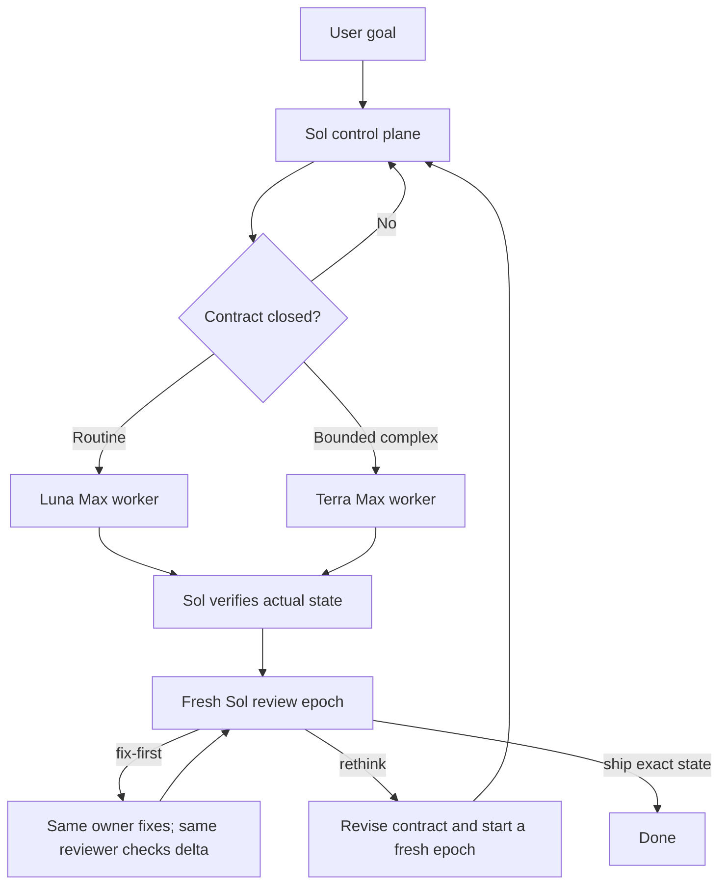

# Codex Cost Orchestrator

[English](README.md) | [简体中文](README.zh-CN.md)

Cost-aware, contract-driven orchestration for native Codex agents.

Codex Cost Orchestrator keeps the user goal, architecture, decomposition, and final
acceptance in a primary Sol session. It routes closed implementation contracts to a
Luna Max routine lane or a Terra Max complex lane, verifies the actual repository
state in the primary session, and gates orchestrated completion through a Sol review
epoch. Read-only requests and guarded atomic edits avoid that delegation overhead.

The goal is not to make every turn cheap. It is to move well-specified implementation
volume to the least costly adequate worker while keeping expensive planning and
acceptance decisions in the strongest control plane.

## Default routing policy

### Implicit by default

The skill declares `allow_implicit_invocation: true`, so a user can describe a coding
task naturally without typing `$codex-cost-orchestrator:orchestrate`. Its description
is written to match medium and large implementation, bug fixes, refactors,
cross-module changes, risky work, and tasks that benefit from independent acceptance.

Implicit eligibility is not an unconditional spawn. The router first classifies the
request by uncertainty, coupling, impact, and verification needs:

- read-only analysis, explanation, planning, status checks, and diagnosis without a
  requested fix stay in Sol without a work graph;
- a confidently atomic low-risk implementation may use the direct fast path; and
- every other implementation uses the full CCO work graph, worker lanes, primary
  verification, and review epoch.

This repository's root [AGENTS.md](AGENTS.md) makes that routing policy the default
while developing CCO itself. In another repository, installed-skill matching can
select it implicitly; copy or adapt the root policy into that repository when you
want a deterministic project-level rule. Higher-priority instructions and explicit
user choices still win.

### Direct fast path

Sol may implement directly only when the result is unambiguous, mechanically
determined, small, atomic, confined to one bounded area, and adequately covered by one
focused verification. It must not affect public interfaces, schemas, migrations,
dependency boundaries, authentication, authorization, security controls, concurrency,
build or release behavior, or destructive data paths. Worktree ownership must also be
clear, and delegation or independent review must offer no material value.

File count is evidence, not the definition: a one-file authentication change may need
full orchestration, while a mechanical edit can occasionally touch several tightly
coupled files and remain direct. The direct path still requires inspection of the
actual delta and proportionate verification; it simply omits worker and review-epoch
overhead. Before writing, Sol records an exact `DIRECT_BASELINE` plus pre-existing
changed paths so an unexpected upgrade can still separate task work from user work.

### Upgrade during execution

A direct task is upgraded before work continues when its scope reaches another
bounded area, a material interface or ownership decision appears, initial verification
fails for a non-trivial reason, diagnosis becomes systemic, regression risk grows, or
independent review becomes useful.

The original `DIRECT_BASELINE` remains the final review baseline. Sol freezes and
inspects its existing delta, registers it as an exact Sol-owned change set, and uses
the current state only as the baseline for later worker leases. The final review spans
the original baseline through the finished state, including both the Sol-owned delta
and every worker delta; no early edit can disappear behind a rebased lease.

### User override

Naming or invoking `$codex-cost-orchestrator:orchestrate` selects the router but does
not alone force delegation. Ask for the full CCO flow, worker lanes, or a review epoch
to force orchestration. A no-delegation, single-agent, or direct-execution constraint
overrides mere Skill selection. If one effective instruction both requires full CCO
and forbids delegation, Codex stops before writing and asks for resolution. No override
removes focused verification or permits unsupported claims about tests, review, or
isolation.

For a full flow, CCO requires its reviewer plus each worker role used by the graph. A
missing or mismatched role fails closed before delegated writes. CCO reports the role
and recovery command; it does not edit `CODEX_HOME` or silently substitute a generic
agent.

### Completion by route

- A no-write result answers the request without implementation or review claims.
- A direct result compares the final state with `DIRECT_BASELINE`, inspects every
  task-owned path, runs focused checks, and explicitly reports that no review epoch ran.
- An orchestrated result requires all Sol-owned and worker-owned changes to be covered,
  acceptance-critical checks to pass, and a `ship` verdict bound to the exact final
  state.

## Roles

| Responsibility | Native role | Pinned profile | Boundary |
| --- | --- | --- | --- |
| Control plane | Primary Codex task | Sol; effort selected by the user | Resolve ambiguity, design, decompose, route, verify, and accept |
| Routine lane | `cost_orchestrator_routine_worker` | GPT-5.6 Luna / Max | Fully determined, mechanical, independently verifiable work |
| Complex lane | `cost_orchestrator_complex_worker` | GPT-5.6 Terra / Max | Bounded algorithms, debugging, compatibility, security, or wider implementation judgment |
| Review lane | `cost_orchestrator_reviewer` | GPT-5.6 Sol / High; requests read-only | Fresh epoch review and contract-preserving delta review |

The worker profiles disable their own agent collaboration features. They are leaf
executors, not secondary orchestrators. A worker must stop when a needed decision is
outside its versioned contract or write set.



## What the protocol changes

### Versioned work nodes

Every delegated node uses a `cco.v3` packet with a stable `NODE`, material
`CONTRACT_REV`, unique agent-thread `RUN`, baseline-bound `LEASE`, exact write paths,
interfaces, discretion, exclusions, acceptance criteria, and expected verification
evidence. A current packet supersedes inherited conversational assumptions.

The control plane also maintains a single-flight ledger for each
`NODE@CONTRACT_REV`. A revision cannot be spawned twice while active or accepted;
contract-preserving retries continue the recorded canonical task path, and a new run
must first retire the old owner.

Luna is the default only when the packet determines the result. Terra is used when
architecture and interfaces are already fixed but bounded implementation judgment
remains. Work stays in Sol while the objective, architecture, public interface,
ownership, or acceptance criteria are unresolved.

### Bounded context and cache-aware dispatch

Custom roles use `fork_turns: none` when the packet plus repository anchors are
sufficient. When inherited conversation is indispensable, the orchestrator selects
the smallest positive turn count that contains the earliest still-binding decision.
It never uses `fork_turns: all` with these custom roles.

Stable policy lives in the role profiles; changing task facts live in compact packets.
This avoids repeatedly sending tool schemas, environment descriptions, full histories,
or complete diffs. A partial context fork rebuilds child context, so this policy is a
correctness and token-control rule, not a promise of a provider cache hit.

### Behavioral write leases and baseline verification

The Sol control plane issues one non-overlapping behavioral write `LEASE` per active
node and serializes shared paths. Before accepting a result, Sol compares the current
state with the recorded baseline, checks that changed paths are inside the lease,
inspects the actual diff, preserves pre-existing work, and reruns acceptance-critical
verification.

A lease is not an operating-system lock. It is a control-plane ownership rule backed
by detection. Unexpected changes stop the node and require the baseline to be
re-established; the orchestrator does not guess-merge concurrent work.

The shipped helper captures a Git-visible state as JSON and verifies a later delta
against exact allowed paths:

```text
python plugins/codex-cost-orchestrator/scripts/workspace_state.py capture --repo <repository> --output <external-baseline.json>
python plugins/codex-cost-orchestrator/scripts/workspace_state.py verify --repo <repository> --baseline <external-utf8-baseline.json> [--allow <path> ...]
```

The capture command writes UTF-8 JSON atomically and refuses an output path inside the
repository. The verifier fails if `HEAD` or the Git index changed, lists
baseline-relative paths, and rejects paths outside the lease. It never stages, cleans,
resets, or rewrites files. Ignored files remain outside its observation surface, and
concurrent writers can still race the capture/check window.
Omit `--allow` to reject every mutation during a behaviorally read-only review.

### Same-thread corrections

Contract-preserving corrections, verification requests, and completion requests reuse
the existing worker with a compact `CCO_WORK_FOLLOWUP`. A new worker run is required
when the role or any material contract field changes. The old owner must stop before a
lease transfers, and an unchanged failed prompt is not simply repeated.

This reduces duplicate planning and prevents parallel workers from silently expanding
or overlapping the same assignment.

Reuse is a live same-session optimization. A completed hard-leaf agent that has been
unloaded or resumed cold may return `ThreadNotFound`; the orchestrator keeps the hard
leaf controls, starts a new worker `RUN` with the unchanged contract when needed, and
uses a new fresh review epoch if the missing target was the reviewer.

The plugin's fail-open `SubagentStop` hook checks only the structure of explicit CCO
worker and reviewer result packets. On the first incomplete packet it requests one
bounded continuation that tells the agent not to redo completed work; an active second
stop is always allowed. The hook does not judge the truth of a report, enforce a
lease, or replace primary verification.

Plugin hooks are discovered enabled but untrusted, so they do not execute merely
because the plugin is installed. Open `/hooks`, inspect the plugin-sourced command and
current hash, and explicitly trust that definition before relying on this check. A
changed current hash requires a new trust decision.
Command hooks run with ambient OS permissions rather than the reviewer sandbox; the
shipped hook is read-only and its workspace non-mutation behavior is tested, but its
source should still be inspected before trust is granted.

### Review epochs

The first review of every epoch uses a fresh Sol reviewer with no inherited turns. If
the reviewer returns `fix-first` and the contract remains unchanged, the owning worker
implements the bounded fix and the same reviewer performs a delta review. A change to
the goal, architecture, public interfaces or schemas, safety constraints, ownership,
exclusions, or acceptance criteria starts a new fresh epoch. `rethink` also starts a
new epoch.

A `ship` verdict is bound to one exact `STATE`; any later mutation invalidates it.

## Install

Requirements:

- a current Codex CLI or desktop build with plugins, native subagents, and custom
  agents available;
- access to the Sol, Terra, and Luna profiles named above;
- Git and Python 3.11 or newer.

Clone the public repository, register that checkout as a marketplace, install the
plugin, and install the companion role profiles:

```text
git clone https://github.com/KirschBluteX/codex-cost-orchestrator.git
cd codex-cost-orchestrator
codex plugin marketplace add .
codex plugin add codex-cost-orchestrator@codex-cost-orchestrator
python plugins/codex-cost-orchestrator/scripts/install_agents.py
python plugins/codex-cost-orchestrator/scripts/install_agents.py --check
```

The same commands work in PowerShell and POSIX shells. On Windows, `py -3` can replace
`python` when that is the configured Python launcher.

The installer adds only missing files. It never overwrites a differing user-owned
profile, edits `config.toml`, or invokes Codex. Its default target is
`$CODEX_HOME/agents` when `CODEX_HOME` is set and `~/.codex/agents` otherwise. Use an
explicit disposable target when evaluating the installer:

```text
python plugins/codex-cost-orchestrator/scripts/install_agents.py --target-dir <agents-directory>
python plugins/codex-cost-orchestrator/scripts/install_agents.py --target-dir <agents-directory> --check
```

Repeat `--profile routine`, `--profile complex`, or `--profile reviewer` to install or
check only the roles required by a particular graph. With no `--profile`, all three
are selected.

Start a new Codex task after installation. Custom agent types are discovered when a
task starts, so an already-open task may not see the new profiles.

Explicit invocation is not required for ordinary matching implementation requests.
This example also asks for worker lanes and a review epoch, so it forces the full path:

```text
Use $codex-cost-orchestrator:orchestrate to implement and verify this change through cost-aware worker lanes and a review epoch.
```

## Runtime routing evidence

Codex's native spawn/details metadata is the first source of role, model, and effort
evidence. When required fields are omitted and local rollouts are accessible, the
read-only fallback inspector accepts one exact native thread UUID:

```text
python plugins/codex-cost-orchestrator/scripts/inspect_agent_runtime.py <thread-id>
python plugins/codex-cost-orchestrator/scripts/inspect_agent_runtime.py --sessions-dir <sessions-directory> <thread-id>
```

It emits only `thread_id`, `agent_role`, `model`, `effort`,
`sandbox_policy_type`, and `permission_profile_type`. It rejects invalid IDs,
ambiguous matches, and missing or conflicting required metadata. It does not emit
prompts, messages, paths, provider configuration, environment variables, or arbitrary
rollout payloads.

## Update

Version 0.2.0 starts a new repository history. Re-clone once if an existing checkout
predates 0.2.0, then register that new checkout as the marketplace. For a checkout at
0.2.0 or later:

```text
git pull --ff-only
codex plugin add codex-cost-orchestrator@codex-cost-orchestrator
python plugins/codex-cost-orchestrator/scripts/install_agents.py --check
```

If a shipped profile changed, the exactness check fails rather than overwriting the
installed copy. Inspect and deliberately reconcile the installed profile with the new
template, rerun `--check`, and then start a new Codex task.

## Local verification

The repository test suite and diff check are platform-neutral:

```text
python -X utf8 -B -m unittest discover -s tests -v
git diff --check
```

When the bundled Codex creator skills are installed, also run their validators.

POSIX:

```sh
codex_home=${CODEX_HOME:-"$HOME/.codex"}
python "$codex_home/skills/.system/plugin-creator/scripts/validate_plugin.py" plugins/codex-cost-orchestrator
python "$codex_home/skills/.system/skill-creator/scripts/quick_validate.py" plugins/codex-cost-orchestrator/skills/orchestrate
```

PowerShell:

```powershell
$codexHome = if ($env:CODEX_HOME) { $env:CODEX_HOME } else { Join-Path $HOME ".codex" }
python (Join-Path $codexHome "skills/.system/plugin-creator/scripts/validate_plugin.py") plugins/codex-cost-orchestrator
python (Join-Path $codexHome "skills/.system/skill-creator/scripts/quick_validate.py") plugins/codex-cost-orchestrator/skills/orchestrate
```

The legacy POSIX entry points `install-agents.sh`, `inspect-agent-runtime.sh`, and
`verify.sh` remain as thin wrappers over the Python implementations. Set `PYTHON` to
an alternate Python executable path if `python3` is not on `PATH`.

CI runs the unittest suite, the repository plugin contract validator, the pinned
OpenAI skill validator, and `git diff --check` on Windows and Ubuntu. It uses only
disposable runner state; it does not install the plugin into a user's Codex home or
make model calls. The current official Codex plugin validator is also run during local
release verification because it is distributed with Codex rather than the pinned
`openai/skills` checkout.

## Limits and trust model

- Write leases, packet conformance, and changed-path checks are detect-only policy
  controls, not filesystem isolation.
- Codex hooks are currently fail-open and never replace primary-session diff and test
  verification.
- The reviewer profile requests `read-only`, but live host permissions can broaden
  that request. Only observed `read-only` metadata justifies an OS-enforced claim.
  Otherwise review is merely behaviorally read-only, requires exact before/after state
  comparison, and must report the broader permissions as residual risk.
- Worker and reviewer result packets are claims until the primary Sol session checks
  the actual state and evidence.
- Fresh Sol review is context-independent from the orchestrator, not model-family or
  provider independent.
- This repository defines routing and verification policy. It does not provide hard
  workspace leases, a standalone agent runtime, provider switching, a persistent cost
  ledger, or a guarantee of a particular savings ratio. Actual cost depends on task
  closure, context size, retry rate, and model pricing.
