# Codex Cost Orchestrator

[简体中文](README.zh-CN.md)

Codex Cost Orchestrator (CCO) is an implicit control plane for Codex native Agents.
It keeps planning and final acceptance in the Primary Agent, dispatches only closed
work, and uses a static local model policy designed to avoid paying for Sol on every
child task.

CCO does not create another Agent runtime. Codex still owns spawn, follow-up,
interrupt, sandboxing, and execution. CCO compiles and guards those native calls.

## What 1.1 provides

- Logical `explorer`, `worker`, and `reviewer` roles over two model-neutral physical
  profiles: read-only and writable.
- Fact-derived `mechanical`, `bounded`, and `guarded` assurance instead of a vague
  simple/complex label.
- Structural placement gates, including parallelism, context partitioning, closed
  chains, isolation, recovery, independent evidence, and explicit delegation.
- Network-free static Luna/Terra routing with current user model/effort pins.
- Strict interception of ordinary native Agent spawns; native inheritance requires an
  explicit user-authorized bypass.
- `cco.v7` capsules, prepared scope-limited baselines, owner/cursor fencing, guarded
  generations, failure signatures, and late-result tombstones.
- One fail-closed dispatch transaction that keeps full capsules outside Primary
  context and exposes only short native spawn references.
- Explicit DAG dependencies, completed-node input, downstream-aware scheduling, and
  safe whole-graph aggregation of compatible microtasks.
- Per-spawn workspace leases: active sibling changes are allowed only inside their
  non-conflicting scopes; pending or out-of-graph changes fail closed.
- Acceptance IDs connected to structured evidence and the exact workspace delta.
- Event-driven Primary waiting and no CCO concurrency ceiling below native capacity.
- No Radar dependency, runtime route cache, token/billing history, or cost telemetry.

## Decision flow

```mermaid
flowchart LR
    U["User goal"] --> P["Primary closes contracts"]
    P --> D["Role + assurance + placement"]
    D -->|"not closed / no child benefit"| P
    D --> R["Static local route"]
    R --> G["Prepared cco.v7 graph"]
    G --> T["Short-ref dispatch transaction"]
    T --> H["PreToolUse + ledger"]
    H --> A["Codex native Agent"]
    A --> E["Result + exact-state evidence"]
    E --> V["Primary acceptance or risk-triggered reviewer"]
```



CCO also keeps the Primary quiet after dispatch: it may continue only proven
non-overlapping, dependency-independent work; otherwise it waits for native events.

## Fast dispatch

The normal path is deliberately short:

```text
close the whole graph once → compile once → spawn the ready batch in one model turn
→ enter one long event wait
```

Shared facts are supplied once through graph `defaults`. The compiler aggregates
compatible Primary microtasks, derives the ready DAG frontier, captures one baseline,
routes every node locally, commits one transaction, and returns only exact short
spawn references. While references remain pending, the hook permits no intervening
file reads, edits, tests, route explanations, or status checks. A pre-thread rejection
advances only that node to its already-prepared fallback; active siblings continue.

If the user request and repository policy already close the graph, Primary should not
inspect the repository again before compiling it. One missing material fact goes to a
narrow explorer rather than an open-ended Primary investigation. After spawn, Primary
wakes only for child completion, blocking input, a user message, or the 30-minute
native protection timeout; the timeout does not terminate children.

## Default routes

| Logical role / assurance | First | Pre-thread fallback |
| --- | --- | --- |
| explorer or worker / mechanical | Luna | Terra |
| explorer or worker / bounded | Terra | Luna |
| explorer or worker / guarded | Terra | none |
| reviewer / any assurance | Terra | none |

For each automatic model, effort adapts through `max → xhigh → high`. `ultra` and Sol
are never automatic. A current explicit user pin may choose any native-supported
model/effort pair, including Sol or guarded Luna. A full pin has no fallback.

Bounded Luna fallback is available only after the contract is closed, risks are
absent, coverage is deterministic, and Terra is unavailable before a thread starts.
Any incomplete, blocked, or deviating result forces a guarded next generation.

## Requirements

- Codex CLI or Codex desktop with plugin hooks and native Agents. CLI `0.146.0` and
  Desktop build `26.730.8199.0` are the release-tested contracts.
- Python 3.11 or newer.
- Git.
- Windows or Linux. macOS is not currently tested.

CCO is not currently intended for surfaces that do not load Codex plugins/hooks.

## Install

```text
git clone https://github.com/KirschBluteX/codex-cost-orchestrator.git
cd codex-cost-orchestrator
codex plugin marketplace add KirschBluteX/codex-cost-orchestrator --ref main
codex plugin add codex-cost-orchestrator@codex-cost-orchestrator
python plugins/codex-cost-orchestrator/scripts/install_agents.py --workspace . --bootstrap
```

Then:

1. Open `/hooks` in Codex.
2. Review and trust every current CCO hook definition.
3. Run the read-only readiness check:

```text
python plugins/codex-cost-orchestrator/scripts/install_agents.py --workspace . --doctor
```

Doctor must report both `HOOKS READY` and `STATIC ROUTE READY`. Start a new Codex task
after installation or update so the new skill, profiles, and hooks are loaded.

The two installed leaf profiles are intentionally model-neutral. Current Codex hosts
accept the selected Luna/Terra model and effort as explicit native spawn values, so
CCO does not install duplicate model-specific profiles. `STATIC ROUTE READY` validates
the local capability catalogue; the real spawn response remains final evidence.

CCO is implicit after that. For example, ask Codex normally:

```text
Refactor this module, preserve its public behavior, and verify the result.
```

You do not need to mention CCO or call a skill explicitly.

### Update

```text
codex plugin marketplace upgrade codex-cost-orchestrator
codex plugin remove codex-cost-orchestrator@codex-cost-orchestrator
codex plugin add codex-cost-orchestrator@codex-cost-orchestrator
python plugins/codex-cost-orchestrator/scripts/install_agents.py --workspace . --bootstrap
python plugins/codex-cost-orchestrator/scripts/install_agents.py --workspace . --doctor
```

Review and trust changed hooks again, then start a new task.

### Uninstall

```text
python plugins/codex-cost-orchestrator/scripts/install_agents.py --workspace . --uninstall
codex plugin remove codex-cost-orchestrator@codex-cost-orchestrator
codex plugin marketplace remove codex-cost-orchestrator
```

The installer removes only byte-identical CCO-owned profiles. Modified or unknown
files are preserved and reported for manual review.

## Configuration

Configuration precedence is:

```text
current user pin → trusted project policy → global policy → built-in defaults
```

Global configuration lives at `~/.codex/cco.toml`:

```toml
trusted_project_roots = ["C:/work/my-project"]

[routes.worker.mechanical]
candidates = [
  { model = "gpt-5.6-luna", effort = "max" },
  { model = "gpt-5.6-terra", effort = "max" },
]

[routes.reviewer.guarded]
candidates = [
  { model = "gpt-5.6-terra", effort = "max" },
]
```

A trusted project may override routes in `.codex/cco.toml` using the same `routes`
tables. Project policy is ignored until its canonical repository root is listed in the
global `trusted_project_roots` array.

Automatic configuration cannot contain Sol. Guarded or reviewer automatic policy
cannot contain Luna. Invalid higher-priority configuration or unsupported candidates
leave affected work in Primary rather than silently using a lower-priority route.

Normal operation does not display route scoring or cost rationale. `--doctor` and the
graph compiler's `--full` mode are explicit local diagnostics.

## Explicit native bypass

If you intentionally want Codex's native Agent behavior and inherited model/effort,
say so explicitly in the current user request. CCO then prefixes that one unmanaged
spawn with:

```text
CCO_NATIVE_BYPASS v1
```

The hook strips the marker before dispatch. CCO never infers bypass permission, and a
bypassed owner is outside CCO lifecycle and evidence guarantees.

## Security and data behavior

- PreToolUse fails closed for unprepared ordinary spawns and managed continuations.
- The prepared workspace fingerprints tracked content and ignored files inside typed
  scopes, even in the default light mode. Git status and Git control state remain
  repository-wide so newly created out-of-scope deltas are still detected.
- Worker result paths must exactly equal the real delta inside that node's scopes.
- Large terminal graph artifacts are removed immediately. Small task tombstones stay
  outside the repository for late-result fencing. A later SessionStart removes
  SessionEnd removes terminal task residue immediately. A later SessionStart remains
  the fallback: terminal residue expires after 24 hours and live/unknown abandoned
  state after up to seven days.
- CCO sends no CCO telemetry and stores no token counts, billing records, Radar data,
  or long-term route history. A temporary prepared artifact necessarily contains the
  closed node contracts, scopes, route bindings, and workspace fingerprints; it does
  not copy repository file contents or the full conversation.
- Hashes provide canonical identity and stale-result fencing; they are not encryption
  or authentication against a malicious Primary/leaf.
- Hook trust remains a user decision. Bootstrap and doctor never grant it.

See [SECURITY.md](SECURITY.md) and [operations](docs/OPERATIONS.md) for boundaries and
recovery.

## Validation

```text
python -m ruff check plugins tests .github/scripts
python -X utf8 -B -m unittest discover -s tests -v
python .github/scripts/validate_plugin.py plugins/codex-cost-orchestrator
```

CI covers Windows/Python 3.14 and Linux/Python 3.11. See
[benchmark methodology](docs/BENCHMARK.md); the project does not claim a universal
bill-savings percentage without workload-matched measurements.

## Project status

Version 1.1.1 keeps the stable `cco.v7` wire protocol while making global lifecycle
hooks safe for desktop tasks rooted above or outside a Git repository. Dispatch
transactions remain bound to their exact prepare-time repository even when the host
working directory differs. It is not a hard security boundary or a replacement for
Primary review. Issues and pull requests are welcome; see
[CONTRIBUTING.md](CONTRIBUTING.md), [ROADMAP.md](ROADMAP.md), and
[CHANGELOG.md](CHANGELOG.md).

MIT License. Copyright (c) 2026 KirschQAQ.
