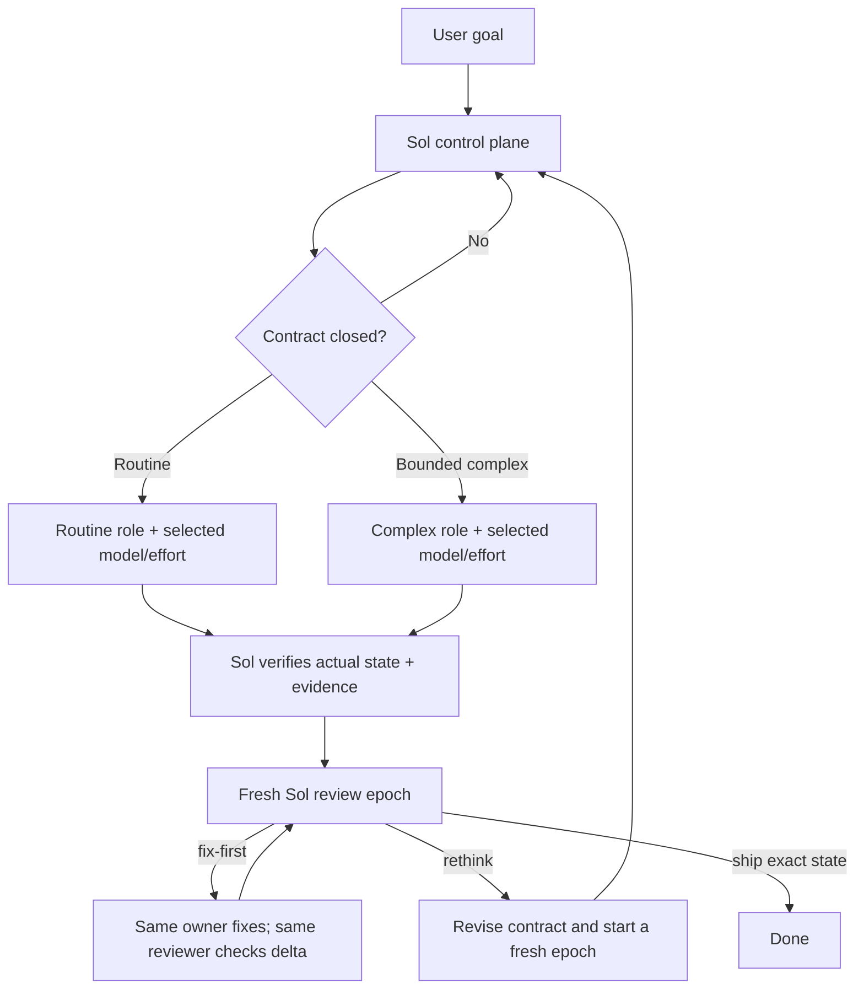

# Codex Cost Orchestrator

[English](README.md) | [简体中文](README.zh-CN.md)

Cost-aware, contract-driven orchestration for native Codex agents.

Codex Cost Orchestrator (CCO v4) keeps the user goal, architecture, decomposition, and
final acceptance in a primary Sol session. It routes closed contracts to model-neutral
leaf roles with user-selectable model and reasoning effort, verifies the actual
repository state and primary evidence in Sol, and gates orchestrated completion through
an exact-state review epoch. Read-only requests and guarded atomic edits avoid that
delegation overhead.

The goal is not to make every turn cheap. It is to move well-specified implementation
volume to the least costly adequate worker while keeping expensive planning and
acceptance decisions in the strongest control plane.

## Default routing policy

### Implicit by default

The skill declares `allow_implicit_invocation: true`, so a user can describe a coding
task naturally without typing `$codex-cost-orchestrator:orchestrate`. Its description
is written to match medium and large implementation, bug fixes, refactors,
cross-module changes, risky work, and tasks that benefit from independent acceptance.

Implicit eligibility is not an unconditional spawn. The router first classifies the
request by uncertainty, coupling, impact, and verification needs:

- read-only analysis, explanation, planning, status checks, and diagnosis without a
  requested fix stay in Sol without a work graph;
- a confidently atomic low-risk implementation may use the direct fast path; and
- every other implementation uses the full CCO work graph, worker lanes, primary
  verification, and review epoch.

This repository's root [AGENTS.md](AGENTS.md) makes that routing policy the default
while developing CCO itself. In another repository, installed-skill matching can
select it implicitly; copy or adapt the root policy into that repository when you
want a deterministic project-level rule. Higher-priority instructions and explicit
user choices still win.

### Direct fast path

Sol may implement directly only when the result is unambiguous, mechanically
determined, small, atomic, confined to one bounded area, and adequately covered by one
focused verification. It must not affect public interfaces, schemas, migrations,
dependency boundaries, authentication, authorization, security controls, concurrency,
build or release behavior, or destructive data paths. Worktree ownership must also be
clear, and delegation or independent review must offer no material value.

File count is evidence, not the definition: a one-file authentication change may need
full orchestration, while a mechanical edit can occasionally touch several tightly
coupled files and remain direct. The direct path still requires inspection of the
actual delta and proportionate verification; it simply omits worker and review-epoch
overhead. Before writing, Sol records an exact `DIRECT_BASELINE` plus pre-existing
changed paths so an unexpected upgrade can still separate task work from user work.

### Upgrade during execution

A direct task is upgraded before work continues when its scope reaches another
bounded area, a material interface or ownership decision appears, initial verification
fails for a non-trivial reason, diagnosis becomes systemic, regression risk grows, or
independent review becomes useful.

The original `DIRECT_BASELINE` remains the final review baseline. Sol freezes and
inspects its existing delta, registers it as an exact Sol-owned change set, and uses
the current state only as the baseline for later worker leases. The final review spans
the original baseline through the finished state, including both the Sol-owned delta
and every worker delta; no early edit can disappear behind a rebased lease.

### User override

Naming or invoking `$codex-cost-orchestrator:orchestrate` selects the router but does
not alone force delegation. Ask for the full CCO flow, worker lanes, or a review epoch
to force orchestration. A no-delegation, single-agent, or direct-execution constraint
overrides mere Skill selection. If one effective instruction both requires full CCO
and forbids delegation, Codex stops before writing and asks for resolution. No override
removes focused verification or permits unsupported claims about tests, review, or
isolation.

For a full flow, CCO requires its reviewer plus each worker role used by the graph. A
missing or mismatched role fails closed before delegated writes. CCO reports the role
and recovery command; it does not edit `CODEX_HOME` or silently substitute a generic
agent.

### Completion by route

- A no-write result answers the request without implementation or review claims.
- A direct result compares the final state with `DIRECT_BASELINE`, inspects every
  task-owned path, runs focused checks, and explicitly reports that no review epoch ran.
- An orchestrated result requires all Sol-owned and worker-owned changes to be covered,
  acceptance-critical checks to pass, and a `ship` verdict bound to the exact final
  state.

## Roles and worker selection

| Responsibility | Native role | Runtime selection | Boundary |
| --- | --- | --- | --- |
| Control plane | Primary Codex task | Sol; effort selected by the user | Resolve ambiguity, design, decompose, route, verify, and accept |
| Routine lane | `cost_orchestrator_routine_worker` | User-selected per node; route order starts Luna / Max, then Terra / Max | Fully determined, mechanical, independently verifiable work |
| Complex lane | `cost_orchestrator_complex_worker` | User-selected per node; Terra / Max is the route recommendation | Bounded algorithms, debugging, compatibility, security, or wider implementation judgment |
| Review lane | `cost_orchestrator_reviewer` | GPT-5.6 Sol / High; requests read-only | Fresh epoch review and contract-preserving delta review |

Routine and complex describe contract closure, not fixed models. Worker TOMLs omit
`model` and `model_reasoning_effort`; native spawn carries the selected dimensions.
The profiles disable their own collaboration features, so workers remain leaf
executors rather than secondary orchestrators. Codex native subagent tools remain the
only agent runtime.

Choose values in the task request, independently by lane or node. For example:

```text
Use CCO for this change. Use <model-a> at high effort for routine nodes, <model-b> at max effort for complex nodes, and keep the reviewer default.
```

Use `native` for either dimension when Codex should inherit/resolve it instead. If no
choice is given, routine uses the finite Luna Max then Terra Max preference order;
complex uses Terra Max. When Codex exposes a native capability catalog, CCO checks the
model, supported effort, and task-required capabilities before dispatch. Native spawn
validation and observed effective values remain authoritative.

The dimensions remain independent during fallback. CCO overlays them into candidate
tuples and advances only a dimension whose policy is `route_default`; an explicit user
value and an omitted `native` dimension remain unchanged.



## What the protocol changes

### Versioned work nodes

Every delegated node uses a `cco.v4` packet with a stable `NODE`, material
`CONTRACT_REV`, canonical `CONTRACT_SHA256`, chained `INPUT_CLOSURE_SHA256`, unique
agent-thread `RUN`, finite `ATTEMPT` and `FOLLOWUP`, bound `fork_turns`, baseline-bound `LEASE`,
`LEASE_GENERATION`, `STOP_GENERATION`, exact write paths, stable acceptance IDs, and
expected verification evidence. The initial work packet plus the latest valid chained
live in-turn steer supersedes inherited conversational assumptions.

The control plane also maintains a single-flight ledger for each
`NODE@CONTRACT_REV`. One active owner is allowed. A contract-preserving steer may
continue the recorded canonical task path only while that worker is still running; a
completed worker receives a new run, attempt, explicit route, and lease generation.

### Per-node model and effort

The user can select model and effort independently for every worker node. `MODEL_POLICY`
and `EFFORT_POLICY` each use `user`, `route_default`, or `native`. A user value always
wins. Route defaults use Luna Max then Terra Max for routine and Terra Max for complex
without pinning either worker TOML. A native dimension is omitted from spawn so Codex
resolves it from current defaults or inheritance. A rejected proposal that creates no
thread consumes no worker attempt or lease generation; a user selection never falls
back, while a route default may try only its next predeclared candidate. Once a usable
worker exists, an unobservable or mismatched route is fenced and rejected.

### Structural Multi gate

Full orchestration does not automatically mean concurrent fan-out. Multi dispatch
requires at least two dependency-ready nodes, closed contract and input hashes,
pairwise-disjoint write leases, complete acceptance ownership, and a planned
independent review epoch, plus native capacity for at least two worker threads.
Otherwise CCO serializes, merges an artificial split, or
keeps unresolved work in Sol. Price, tokens, latency, request count, file count, and
predicted quality are advice, not hard gates.

### Hash-bound inputs, fencing, and bounded recovery

`CONTRACT_SHA256` binds stable task semantics. Every initial dispatch and follow-up has
an `INPUT_CLOSURE_SHA256`; follow-ups also bind
`PREVIOUS_INPUT_CLOSURE_SHA256`. `LEASE_GENERATION` identifies the active write owner,
while `STOP_GENERATION` is incremented before interrupt to fence late results. It does
not prevent late writes, so Sol still checks the actual workspace delta.

The spawn guardrail rebuilds the canonical contract and initial input preimages from
the readable packet, including `fork_turns` and the complete acceptance-ID set, and
recomputes both hashes. Live worker steers carry canonical `BINDING_JSON` and bind the
full canonical native `TARGET`; reviewer deltas do the same before the native
continuation call.

Attempts are finite across input, role, model, and effort changes for one
`NODE@CONTRACT_REV`; follow-ups are finite and consecutive per run. Sol recomputes a
stable `FAILURE_SIGNATURE` from the structured failure ID, class, exit status, and
bounded diagnostics for failed verification or blocked work. A recurring signature
requires a materially different intervention, not another unchanged prompt.

Build each checksum from the exact JSON preimage defined in
[`contracts-v4.md`](plugins/codex-cost-orchestrator/skills/orchestrate/references/contracts-v4.md):

```text
python plugins/codex-cost-orchestrator/scripts/protocol_hash.py hash --domain contract
python plugins/codex-cost-orchestrator/scripts/protocol_hash.py hash --domain input_closure
python plugins/codex-cost-orchestrator/scripts/protocol_hash.py hash --domain failure
python plugins/codex-cost-orchestrator/scripts/protocol_hash.py hash --domain evidence
```

The helper validates the complete cco.v4 schema before hashing: exact keys and nested
types, policy/null pairing, identifier coverage, NFC text, and canonical set ordering.
It does not turn hashes into authentication, a content store, or proof that omitted
inputs were complete. `INPUTS` entries are fingerprints, not content transport or
locators: each one must correspond to bounded material already included in the packet
or to an exact repository location named in the packet and readable by the worker.

### Bounded context and cache-aware dispatch

Custom roles use `fork_turns: none` when the packet plus repository anchors are
sufficient. When inherited conversation is indispensable, the orchestrator selects
the smallest positive turn count that contains the earliest still-binding decision.
It never uses `fork_turns: all` with a custom role. The pinned Codex source permits a
full-history fork with model/effort overrides alone; CCO's custom role is the reason
that combination remains unavailable here.

Stable policy lives in the role profiles; changing task facts live in compact packets.
This avoids repeatedly sending tool schemas, environment descriptions, full histories,
or complete diffs. A partial context fork rebuilds child context, so this policy is a
correctness and token-control rule, not a promise of a provider cache hit.

### Behavioral write leases and baseline verification

The Sol control plane issues one non-overlapping behavioral write `LEASE` per active
node and serializes shared paths. Before accepting a result, Sol compares the current
state with the recorded baseline, checks that changed paths are inside the lease,
inspects the actual diff, preserves pre-existing work, and reruns acceptance-critical
verification.

A lease is not an operating-system lock. It is a control-plane ownership rule backed
by detection. Unexpected changes stop the node and require the baseline to be
re-established; the orchestrator does not guess-merge concurrent work.

The shipped helper captures a Git-visible state as JSON and verifies a later delta
against exact allowed paths:

```text
python plugins/codex-cost-orchestrator/scripts/workspace_state.py capture --repo <repository> --output <external-baseline.json>
python plugins/codex-cost-orchestrator/scripts/workspace_state.py verify --repo <repository> --baseline <external-utf8-baseline.json> [--allow <path> ...]
```

The capture command writes UTF-8 JSON atomically and refuses an output path inside the
repository. The verifier fails if `HEAD` or the Git index changed, lists
baseline-relative paths, and rejects paths outside the lease. It never stages, cleans,
resets, or rewrites files. Ignored files remain outside its observation surface, and
concurrent writers can still race the capture/check window.
Omit `--allow` to reject every mutation during a behaviorally read-only review.

Protocol paths use exact NFC Git spelling, forward slashes, and repository-relative
segments without aliases such as absolute paths, drives, UNC forms, backslashes,
`.`/`..`, empty segments, or trailing slashes. On a case-insensitive host, Sol compares
active leases by case-folded spelling before dispatch. A documented trailing slash is
used only when deriving an intentional directory-prefix argument for the workspace
helper.

### Live corrections and completed-worker recovery

While a worker is observably running, Sol may deliver one compact,
contract-preserving `CCO_WORK_FOLLOWUP cco.v4` with native `send_message`. Each live
steer increments its bounded counter, carries exact canonical `BINDING_JSON`, preserves
the hash-bound acceptance IDs, binds the complete canonical native `TARGET`, and chains
a new input-closure hash. It is a delta over the initial packet, never standalone
authority.

Current V2 can transparently reload a known completed task, but reload does not replay
the worker's original per-spawn model/effort overrides. Because CCO worker profiles are
model-neutral, a completed or idle worker never receives `followup_task`. Sol inspects
its delta, fences and retires the owner, and creates a new worker `RUN` with a complete
packet, explicit routing, another attempt, and a new lease generation. The same rule
already applies when role, model, effort, non-follow-up input, or a material contract
field changes.

This reduces duplicate planning and prevents parallel workers from silently expanding
or overlapping the same assignment.

Live steering is a same-session optimization, not durable thread storage or a cache-hit
promise. A role-pinned reviewer may use bounded `followup_task` delta review, with its
route, sandbox evidence, and workspace state checked again afterward; an unrecoverable
reviewer uses a bounded fresh attempt. Native `Interrupted` is not terminal, so a
fenced path is never steered again and its lease is not transferred until it is
observed idle or terminal.

The plugin ships fail-open, read-only guardrails. PreToolUse hooks cover native `Agent`,
`send_message`, and `followup_task` calls. They reject structurally inconsistent CCO
roles, packets, full continuation targets, acceptance closures, forks, model/effort
requests, unsupported fields, or envelopes over 1 MiB; rebuild self-contained preimages; and block worker
`followup_task`. They have no persistent ledger and cannot prove prior-hash issuance,
live residency, lease disjointness, or complete hook coverage. The `SubagentStop` hook
checks explicit CCO result envelopes, recomputes a claimed failure checksum, and asks
once for syntax-only envelope repair. That repair is not an implementation follow-up
and cannot authorize more work. Neither hook judges report truth or replaces Sol.

Plugin hooks are discovered enabled but untrusted, so they do not execute merely
because the plugin is installed. Open `/hooks`, inspect the plugin-sourced command and
current hash, and explicitly trust that definition before relying on this check. A
changed current hash requires a new trust decision.
Command hooks run with ambient OS permissions rather than the reviewer sandbox; the
shipped hooks are read-only and their workspace non-mutation behavior is tested, but
their source should still be inspected before trust is granted.

### Review epochs

Sol maps the complete sorted acceptance-ID array to primary evidence at one
`CURRENT_STATE`; each record includes operation, normalized outcome, exit status,
observed result, implementation owner, and artifact hashes. Sol hashes the bundle as
`EVIDENCE_SHA256` and supplies its exact compact canonical preimage as `EVIDENCE_JSON`.
Every record must be `passed` before a fresh or delta review is eligible. The reviewer
recomputes the evidence hash and checks that its acceptance IDs and current state match
the review packet. The first review of every
epoch uses a fresh Sol reviewer with no inherited turns. Its input closure binds every
contract hash, the acceptance IDs, current state, evidence hash, accumulated delta,
and risks.

If the reviewer returns `fix-first` and the contract remains unchanged, the owning
worker implements the bounded fix, Sol refreshes evidence for the new state, and the
same reviewer receives the refreshed canonical `EVIDENCE_JSON`, recomputes it, and
performs a bounded delta review. A change to goal, architecture, public
interfaces or schemas, safety, ownership, exclusions, or acceptance starts a fresh
epoch. `rethink` also starts one. `ship` is valid only when the reviewer echoes the
complete IDs, review closure, `EVIDENCE_SHA256`, and exact `REVIEWED_STATE`; any later
mutation invalidates both evidence and verdict.

## Install

Requirements:

- a current Codex CLI or desktop build with plugins, native subagents, and custom
  agents available;
- access to the reviewer model and whichever worker model/effort combinations the user
  or route selects;
- Git and Python 3.11 or newer.

Clone the public repository, register that checkout as a marketplace, install the
plugin, and install the companion role profiles:

```text
git clone https://github.com/KirschBluteX/codex-cost-orchestrator.git
cd codex-cost-orchestrator
codex plugin marketplace add .
codex plugin add codex-cost-orchestrator@codex-cost-orchestrator
python plugins/codex-cost-orchestrator/scripts/install_agents.py
python plugins/codex-cost-orchestrator/scripts/install_agents.py --check
```

The same commands work in PowerShell and POSIX shells. On Windows, `py -3` can replace
`python` when that is the configured Python launcher.

The installer adds only missing files. It never overwrites a differing user-owned
profile, edits `config.toml`, or invokes Codex. Its default target is
`$CODEX_HOME/agents` when `CODEX_HOME` is set and `~/.codex/agents` otherwise. It also
checks the current workspace by default and fails if a selected role is visibly
shadowed by a differing same-name profile in the target config home or active project
`.codex` layers. Use explicit disposable paths when evaluating the installer:

```text
python plugins/codex-cost-orchestrator/scripts/install_agents.py --target-dir <agents-directory> --workspace <active-workspace>
python plugins/codex-cost-orchestrator/scripts/install_agents.py --target-dir <agents-directory> --workspace <active-workspace> --check
```

Repeat `--profile routine`, `--profile complex`, or `--profile reviewer` to install or
check only the roles required by a particular graph. With no `--profile`, all three
are selected.

Start a new Codex task after installation. Custom agent types are discovered when a
task starts, so an already-open task may not see the new profiles.

Before a full CCO write, the new task must expose native spawn fields for `task_name`,
`message`, `agent_type`, and `fork_turns`, plus `model` or `reasoning_effort` whenever
that dimension is not `native`. Installing profiles and passing `--check` cannot prove
those runtime capabilities; a missing field or role fails closed before delegated
writes.

Run the non-mutating profile check from, or point `--workspace` at, every active target
repository before its first CCO graph. The scan covers visible file-backed layers; it
cannot prove provenance through unexposed managed or runtime configuration, so observed
role/model/effort and exact result checks remain mandatory.

Explicit invocation is not required for ordinary matching implementation requests.
This example also asks for worker lanes and a review epoch, so it forces the full path:

```text
Use $codex-cost-orchestrator:orchestrate to implement and verify this change through cost-aware worker lanes and a review epoch.
```

## Runtime routing evidence

Native V2 spawn returns a canonical task path, not public effective role, model, or
effort details. Native validation proves that the requested combination was accepted;
it does not prove that a custom role did not override it. When local rollouts are
accessible, the read-only inspector accepts either that exact path or the child UUID.
Path lookup uses the current `CODEX_THREAD_ID` as parent by default, or an explicit
parent UUID:

```text
python plugins/codex-cost-orchestrator/scripts/inspect_agent_runtime.py <child-uuid-or-canonical-path>
python plugins/codex-cost-orchestrator/scripts/inspect_agent_runtime.py --sessions-dir <sessions-directory> --parent-thread-id <parent-uuid> <canonical-path>
python plugins/codex-cost-orchestrator/scripts/inspect_agent_runtime.py --expect-role <role> --expect-model <model> --expect-effort <effort> <child-uuid-or-canonical-path>
```

It emits only `thread_id`, `agent_role`, `model`, `effort`,
`sandbox_policy_type`, and `permission_profile_type`. It rejects invalid IDs,
invalid paths or parents, ambiguous matches, and missing or conflicting required
metadata. It does not emit prompts, messages, paths, parent IDs, provider configuration,
environment variables, or arbitrary rollout payloads. Omit an expectation only for a
`native` selection dimension; the effective value must still be present and stable.

## Update

Version 0.3.0 introduces schema-checked CCO v4 packets, model-neutral worker templates,
availability-aware route preferences, and pre-/post-dispatch hook guardrails. For a
clean existing checkout:

```text
git pull --ff-only
codex plugin add codex-cost-orchestrator@codex-cost-orchestrator
python plugins/codex-cost-orchestrator/scripts/install_agents.py --check
```

If a shipped profile changed, the exactness check fails rather than overwriting the
installed copy. Inspect and deliberately reconcile the installed profile with the new
template, rerun `--check`, and then start a new Codex task.

## Local verification

The repository test suite and diff check are platform-neutral:

```text
python -X utf8 -B -m unittest discover -s tests -v
git diff --check
```

When the bundled Codex creator skills are installed, also run their validators.

POSIX:

```sh
codex_home=${CODEX_HOME:-"$HOME/.codex"}
python "$codex_home/skills/.system/plugin-creator/scripts/validate_plugin.py" plugins/codex-cost-orchestrator
python "$codex_home/skills/.system/skill-creator/scripts/quick_validate.py" plugins/codex-cost-orchestrator/skills/orchestrate
```

PowerShell:

```powershell
$codexHome = if ($env:CODEX_HOME) { $env:CODEX_HOME } else { Join-Path $HOME ".codex" }
python (Join-Path $codexHome "skills/.system/plugin-creator/scripts/validate_plugin.py") plugins/codex-cost-orchestrator
python (Join-Path $codexHome "skills/.system/skill-creator/scripts/quick_validate.py") plugins/codex-cost-orchestrator/skills/orchestrate
```

The legacy POSIX entry points `install-agents.sh`, `inspect-agent-runtime.sh`, and
`verify.sh` remain as thin wrappers over the Python implementations. Set `PYTHON` to
an alternate Python executable path if `python3` is not on `PATH`.

CI runs the unittest suite, the repository plugin contract validator, the pinned
OpenAI skill validator, and `git diff --check` on Windows and Ubuntu. It uses only
disposable runner state; it does not install the plugin into a user's Codex home or
make model calls. The current official Codex plugin validator is also run during local
release verification because it is distributed with Codex rather than the pinned
`openai/skills` checkout.

## Limits and trust model

- Write leases, packet conformance, and changed-path checks are detect-only policy
  controls, not filesystem isolation.
- Codex hooks are currently fail-open and never replace primary-session diff and test
  verification.
- The reviewer profile requests `read-only`, but live host permissions can broaden
  that request. Only observed `read-only` metadata justifies an OS-enforced claim.
  Otherwise review is merely behaviorally read-only, requires exact before/after state
  comparison, and must report the broader permissions as residual risk.
- Worker and reviewer result packets are claims until the primary Sol session checks
  the actual state and evidence.
- Profile exactness and shadow scans cover visible file-backed configuration only;
  unexposed managed/runtime role provenance remains an explicit residual risk.
- Fresh Sol review is context-independent from the orchestrator, not model-family or
  provider independent.
- This repository defines routing and verification policy. It does not provide hard
  workspace leases, a standalone agent runtime, provider switching, a persistent cost
  ledger, or a guarantee of a particular savings ratio. Actual cost depends on task
  closure, context size, retry rate, and model pricing.
