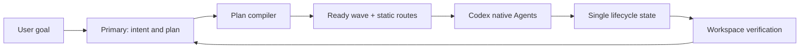

# Codex Cost Orchestrator

[简体中文](README.zh-CN.md)

Codex Cost Orchestrator (CCO) is a thin local control plane for Codex native Agents.
It keeps planning and final acceptance in the Primary task, then routes closed work to
lower-cost native Agents with exact scopes, fresh workspace baselines, and event-driven
waiting.

CCO uses Codex's own Agent runtime. It does not run a second coordinator, contact a
routing service, record billing data, or require an MCP server.

## What it does

- Compiles one logical DAG, then derives dependency-ready execution waves locally.
- Uses `explorer`, `worker`, and `reviewer` roles aligned with native Agent work.
- Routes every requested native subagent through one prepared CCO plan; there is no
  prompt-level direct-spawn bypass.
- Prefers Luna for deterministic mechanical work and Terra for bounded judgment,
  guarded work, and review.
- Never selects Sol automatically; a current explicit user pin can select any native
  supported model and reasoning effort.
- Maximizes non-conflicting work up to the host's observed Agent capacity.
- Allows one writable child across all Codex tasks sharing a canonical workspace,
  permits parallel readers, and rejects overlapping reader/writer scopes.
- Aggregates compatible mechanical microtasks when ready work exceeds native capacity.
- Binds every wave to one fresh Git or bounded non-Git workspace state.
- Waits for native terminal events instead of polling progress.
- Preserves prepared native claims and paused writer leases; reviewer rejection blocks
  downstream work; confirmed active interruption and restart fence stale results.
- Settles Primary-observed typed 429, network, timeout, or temporary service failures
  with at most three exact same-owner retries; arbitrary assistant prose never retries.



## Default routes

| Work | Automatic order |
| --- | --- |
| Mechanical explorer or worker | Luna, then Terra |
| Bounded explorer or worker | Terra, then Luna |
| Guarded work | Terra |
| Reviewer | Terra |

For each model, CCO prefers `max`, then `xhigh`, then `high` when supported. Routes are
resolved at wave creation from the current native capability catalog. A confirmed
pre-thread rejection consumes the next prepared candidate; it never silently inherits
the Primary model.

## Install

Requirements:

- Python 3.11+ (`zstandard` is required before Python 3.14)
- A current Codex installation with plugins, Hooks, and native Agents
- Windows or Linux

Clone the repository and add its marketplace:

```text
git clone https://github.com/KirschBluteX/codex-cost-orchestrator.git
cd codex-cost-orchestrator
python -m pip install -r requirements.txt
codex plugin marketplace add .
codex plugin add codex-cost-orchestrator@codex-cost-orchestrator
```

Install the two model-neutral native Agent profiles:

```text
python -B plugins/codex-cost-orchestrator/scripts/install_agents.py --workspace <YOUR_PROJECT> --bootstrap
```

Open `/hooks`, review and trust the five CCO Hook definitions, then start a new Codex
task. Confirm readiness:

```text
python -B plugins/codex-cost-orchestrator/scripts/install_agents.py --workspace <YOUR_PROJECT> --doctor
```

When intentionally replacing an existing CCO profile pair, add `--replace`. The
installer never overwrites another profile path and never removes a modified file.

## Use

CCO is implicit after installation. Ask Codex for the task normally:

```text
Refactor the parser, preserve behavior, and verify the final state.
```

For an explicit invocation:

```text
Use $codex-cost-orchestrator:orchestrate to implement and verify this change.
```

You can pin a route in ordinary language:

```text
Use Terra/max for workers and the reviewer in this task.
```

Primary closes objectives, scopes, dependencies, and acceptance IDs once. CCO then
handles readiness, route selection, baseline capture, dispatch identity, continuation,
and result mapping. Returned child names include role, logical node, model, effort, and
generation so the live Agent list remains readable.

The normal first wave uses one local `prepare` call for either one child or a compact
multi-node DAG. It consumes the brief from stdin and returns complete native tool inputs;
no temporary contract file or CCO source inspection is part of dispatch. Later dependency
waves require only `next`. The same entry accepts a full DAG when nodes share named
acceptance evidence.

One Codex task owns one plan until explicit inactive cleanup. `status` reports compact
counts plus actionable paused, fenced, or owner-pending dispatch identities. A spawn
response that omits the owner remains pending until trusted SubagentStop rollout evidence
binds it; missing response metadata alone is not treated as worker failure.
An expired `wait_agent` window is not a child timeout: Primary starts another long wait
without retrying the child or performing overlapping work.

Codex currently exposes no tool-failure Hook. If a native spawn, continuation, or
running Agent reports a typed failure, CCO settles that exact dispatch through
`native-failure`. An unclaimed reservation expires defensively; once PreToolUse claims
a call, its lease remains fail-closed until typed settlement, a terminal result, or host
restart recovery. Admission is claimed before workspace verification and rechecked before
the native call, so reservation expiry cannot open a reader/writer race. Interrupt retry
can settle an owner the host already reports as interrupted. It never infers retries from
child prose. If a not-yet-executed spawn baseline is stale, CCO discards that wave and
captures a fresh one on the next `next` call instead of replaying it indefinitely.

Use `$codex-cost-orchestrator:manage-cco` for installation, doctor, configuration,
paused work, restart recovery, retry, abandonment, or cleanup. Normal tasks do not load
those instructions.

## Configuration

Global policy is read from `~/.codex/cco.toml`. Project policy at `.codex/cco.toml` is
used only when its canonical root appears in global `trusted_project_roots`.

```toml
trusted_project_roots = ["C:/work/my-project"]

[routes.worker.mechanical]
candidates = [
  { model = "gpt-5.6-luna", effort = "max" },
  { model = "gpt-5.6-terra", effort = "max" },
]
```

Automatic policy cannot include Sol. A current user pin has higher priority and may
select Sol or another native supported model.

## Safety and scope

CCO is a workflow guardrail, not an OS security boundary. The Primary remains trusted
and owns integration and final acceptance. Read leaves request a read-only sandbox;
workers receive one bounded write lease and must not stage files.

Codex currently treats a crashed or host-timed-out PreToolUse command as fail-open. CCO
uses a shorter internal deadline and returns an explicit block before the host deadline,
but it cannot turn a killed Hook process into an OS-level fail-closed boundary.

Git workspaces protect repository control state, typed scopes, ignored content within
scope, path aliases, submodules, and hidden status cases. Non-Git workspaces are
supported without `git init` and default to 20,000 entries and 1 GiB.

CCO does not calculate a task's real bill or promise a fixed saving percentage. The
benchmark harness records model token fields for controlled comparisons; see
[docs/BENCHMARK.md](docs/BENCHMARK.md).

Operational commands and recovery procedures are in
[docs/OPERATIONS.md](docs/OPERATIONS.md). Security reporting is in
[SECURITY.md](SECURITY.md).

## Development

```text
python -m unittest discover -s tests
python -m ruff check .
python .github/scripts/validate_plugin.py plugins/codex-cost-orchestrator
```

Licensed under the [MIT License](LICENSE).
