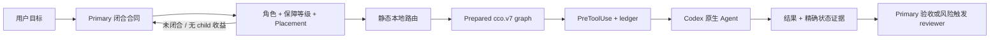

# Codex Cost Orchestrator

[English](README.md)

Codex Cost Orchestrator（CCO）是 Codex 原生 Agent 的隐式控制层。它让 Primary
保留规划与最终验收，只派发已经闭合的工作，并通过静态本地模型策略，避免每个子任务都
使用 Sol。

CCO 不创建第二套 Agent runtime。spawn、follow-up、interrupt、sandbox 和实际执行仍由
Codex 负责；CCO 只编译并守卫这些原生调用。

## 1.0 提供什么

- 逻辑角色为 `explorer`、`worker`、`reviewer`，物理上只使用模型中立的只读/可写
  两个 profile。
- 使用事实推导的 `mechanical`、`bounded`、`guarded` 保障等级，不再依赖宽泛的
  “简单/复杂”标签。
- 只有并行、上下文分区、闭合链、运行隔离、上下文恢复、独立证据或用户明确委派等
  结构收益，才能创建 child。
- 完全离线的 Luna/Terra 静态路由，同时保留当前用户对模型和思考强度的显式 pin。
- 默认严格接管普通原生 Agent spawn；只有用户明确授权时才能恢复原生继承。
- `cco.v7` 胶囊、scope 限定 baseline、owner/cursor fencing、guarded generation、
  failure signature 与迟到结果 tombstone。
- 将 acceptance ID、结构化证据和真实 workspace delta 连接为一条验收链。
- Primary 派遣后事件驱动等待；CCO 不再额外压低 Codex 原生并发容量。
- 不依赖 Radar，不创建运行时路由缓存，也不记录 token、账单或成本统计。

## 决策流程



派遣后，Primary 只可继续已证明不会重叠、冲突或依赖 leaf 的工作；其余情况直接等待
原生事件，不轮询，也不发起只用于“查看进度”的模型请求。

## 默认路由

| 逻辑角色 / 保障等级 | 首选 | 仅限线程创建前的后备 |
| --- | --- | --- |
| explorer 或 worker / mechanical | Luna | Terra |
| explorer 或 worker / bounded | Terra | Luna |
| explorer 或 worker / guarded | Terra | 无 |
| reviewer / 任意等级 | Terra | 无 |

每个自动模型按 `max → xhigh → high` 选择第一个本机支持的强度。系统不会自动选择
`ultra` 或 Sol。当前用户显式 pin 可以选择本机原生 Agent 支持的任意模型/强度，包含
Sol 或 guarded Luna；完整 pin 不设后备。

bounded 使用 Luna 后备的前提是：合同已经闭合、没有声明风险、验收覆盖可确定，并且
Terra 在线程创建前不可用。任何 incomplete、blocked 或 deviation 结果都会强制下一
generation 使用 guarded。

## 环境要求

- 支持插件 hooks 和原生 Agent 的 Codex CLI / Codex 桌面端；本版本按 `0.144.6`
  契约验证。
- Python 3.11 或更高版本。
- Git。
- Windows 或 Linux；当前不测试 macOS。

不加载 Codex plugin/hook 的使用界面目前不在支持范围内。

## 安装

```text
git clone https://github.com/KirschBluteX/codex-cost-orchestrator.git
cd codex-cost-orchestrator
codex plugin marketplace add KirschBluteX/codex-cost-orchestrator --ref main
codex plugin add codex-cost-orchestrator@codex-cost-orchestrator
python plugins/codex-cost-orchestrator/scripts/install_agents.py --workspace . --bootstrap
```

随后：

1. 在 Codex 中打开 `/hooks`。
2. 阅读并信任全部当前 CCO hook。
3. 执行只读 readiness 检查：

```text
python plugins/codex-cost-orchestrator/scripts/install_agents.py --workspace . --doctor
```

doctor 必须同时显示 `HOOKS READY` 和 `STATIC ROUTE READY`。安装或更新后新建一个
Codex 任务，使新的 skill、profile 与 hook 生效。

之后 CCO 会默认隐式运行。例如直接提出：

```text
重构这个模块，保持公开行为不变，并验证最终结果。
```

不需要显式写 `$codex-cost-orchestrator:orchestrate`。

### 更新

```text
codex plugin marketplace upgrade codex-cost-orchestrator
codex plugin remove codex-cost-orchestrator@codex-cost-orchestrator
codex plugin add codex-cost-orchestrator@codex-cost-orchestrator
python plugins/codex-cost-orchestrator/scripts/install_agents.py --workspace . --bootstrap
python plugins/codex-cost-orchestrator/scripts/install_agents.py --workspace . --doctor
```

若 hook 内容变化，需要重新检查并信任，然后新建任务。

### 卸载

```text
python plugins/codex-cost-orchestrator/scripts/install_agents.py --workspace . --uninstall
codex plugin remove codex-cost-orchestrator@codex-cost-orchestrator
codex plugin marketplace remove codex-cost-orchestrator
```

安装器只删除内容与已发布 CCO 文件完全一致的 profile。被用户修改或来源未知的文件会
保留，并提示人工处理。

## 配置

优先级如下：

```text
当前用户 pin → 受信项目配置 → 全局配置 → 内置默认值
```

全局配置位于 `~/.codex/cco.toml`：

```toml
trusted_project_roots = ["C:/work/my-project"]

[routes.worker.mechanical]
candidates = [
  { model = "gpt-5.6-luna", effort = "max" },
  { model = "gpt-5.6-terra", effort = "max" },
]

[routes.reviewer.guarded]
candidates = [
  { model = "gpt-5.6-terra", effort = "max" },
]
```

受信项目可在 `.codex/cco.toml` 使用同样的 `routes` 表进行覆盖。只有其规范化仓库根
路径已经写入全局 `trusted_project_roots` 时，项目配置才会被读取。

自动配置不能包含 Sol；guarded 与 reviewer 的自动配置不能包含 Luna。高优先级配置
错误或候选不受本机支持时，受影响节点会留在 Primary，不会静默采用低优先级方案。

正常任务不会展示路由打分或成本解释。`--doctor` 与 graph compiler 的 `--full` 是显式
本地诊断入口。

## 显式恢复原生派遣

若当前任务确实希望使用 Codex 原生 Agent 行为和模型/强度继承，请在用户请求中明确
说明。CCO 只会为这一次非托管 spawn 添加：

```text
CCO_NATIVE_BYPASS v1
```

hook 会在派遣前移除标记。CCO 不会自行推断 bypass 权限；bypass owner 也不再享受
CCO 生命周期和证据保证。

## 安全与本地数据

- PreToolUse 对未准备的普通 spawn 和受管 continuation 采用 fail-closed。
- prepared workspace 只在 typed scope 内指纹化 tracked 内容与 ignored 文件；即使是默认
  light 模式，也会保留全仓库 Git status 与 Git control state，以发现新产生的 scope 外变更。
- worker 声明的 changed paths 必须与该节点 scope 内的真实 delta 完全一致。
- 大型终态 graph artifact 会立即删除。用于迟到结果 fencing 的小型 tombstone 存放在
  仓库外；后续 SessionStart 会清理超过 24 小时的终态残留，并将仍像 live/unknown 的
  遗留状态保守保留最多 7 天，因为当前 Codex 没有 SessionEnd hook。
- CCO 不发送自身遥测，也不保存 token 数、账单、Radar 数据或长期路由历史。临时
  prepared artifact 必然包含闭合合同、scope、route binding 与 workspace 指纹，但
  不复制仓库文件正文或完整对话。
- hash 用于规范化身份和陈旧结果 fencing，不是加密，也不是抵抗恶意 Primary/leaf 的
  身份认证。
- hook 信任始终由用户决定；bootstrap 和 doctor 都不会自动授权。

详细边界与恢复方式见 [SECURITY.md](SECURITY.md) 和
[运维说明](docs/OPERATIONS.md)。

## 验证

```text
python -m ruff check plugins tests .github/scripts
python -X utf8 -B -m unittest discover -s tests -v
python .github/scripts/validate_plugin.py plugins/codex-cost-orchestrator
```

CI 覆盖 Windows/Python 3.14 与 Linux/Python 3.11。基准方法见
[docs/BENCHMARK.md](docs/BENCHMARK.md)；项目不会在缺少同工作负载对照实验时宣称固定的
账单节省比例。

## 项目状态

1.0.0 是第一版稳定协议，目标是生产导向的流程护栏；它不是硬安全边界，也不能替代
Primary 的最终验收。欢迎提交 issue 与 PR，参见 [CONTRIBUTING.md](CONTRIBUTING.md)、
[ROADMAP.md](ROADMAP.md) 与 [CHANGELOG.md](CHANGELOG.md)。

MIT License。Copyright (c) 2026 KirschQAQ。
