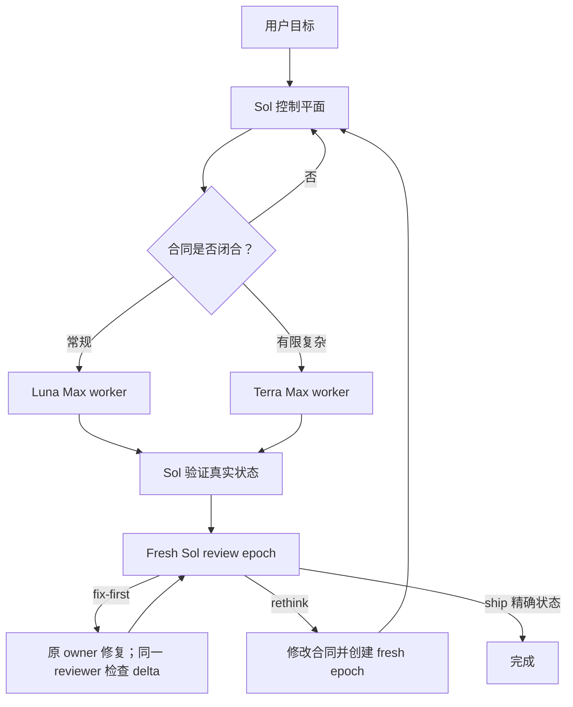

# Codex Cost Orchestrator

[English](README.md) | [简体中文](README.zh-CN.md)

面向 Codex 原生代理、以合同驱动的成本感知编排插件。

Codex Cost Orchestrator（CCO）把用户目标、架构、任务拆分和最终验收保留在主
Sol 会话中；将已经闭合的实现合同交给 Luna Max 常规执行通道或 Terra Max 复杂
执行通道；由主 Sol 检查真实仓库状态；最后通过 Sol 审查 epoch 决定能否交付。

审查 epoch 是完整编排路径的交付门禁；只读请求和受约束的原子修改会避开没有收益的
委派开销。

它的目标不是让每一次调用都尽可能便宜，而是在不降低验收证据质量的前提下，把
规格清晰、实现量较大的工作交给“足够胜任且成本最低”的执行角色，把昂贵模型集中
用于规划、消除歧义、架构决策和最终验收。

## 默认路由策略

### 默认隐式启用

Skill 显式声明了 `allow_implicit_invocation: true`。用户可以直接用自然语言描述代码
任务，不需要每次输入 `$codex-cost-orchestrator:orchestrate`。Skill 的触发描述覆盖
中大型功能、Bug 修复、重构、跨模块修改、高风险改动，以及需要独立验收的工作。

允许隐式启用不等于无条件创建子代理。路由器会先依据不确定性、耦合程度、影响面和
验证需求分类：

- 只读分析、解释、规划、状态查询，以及没有要求修复的诊断，留在 Sol 中直接完成，
  不创建工作图；
- 能够确信为原子、低风险的小型实现，可进入直接执行快速路径；
- 其他实现任务默认使用完整 CCO 流程，包括工作图、执行通道、主会话验证和审查
  epoch。

本仓库根目录的 [AGENTS.md](AGENTS.md) 会在开发 CCO 自身时强制采用这套路由策略。
在其他仓库中，安装后的 Skill 可以依靠描述匹配被隐式选择；如果希望得到确定性的
项目级默认行为，可将本仓库的 `AGENTS.md` 规则复制或按需改写到目标仓库。更高优先级
的指令和用户明确给出的执行方式始终优先。

### 直接执行快速路径

只有同时满足下列条件，主 Sol 才能直接实现：结果无歧义且实现方式基本由合同决定；
修改原子、规模小、局限在一个边界明确的区域；一次聚焦验证足以提供相称的验收证据；
工作区所有权清晰；委派或独立审查不会带来实质收益。

直接路径不能涉及公共接口、Schema、迁移、依赖边界、身份认证、权限控制、安全机制、
并发行为、构建/发布行为或破坏性数据路径。文件数量只是信号，不是定义：单文件的认证
修改可能必须完整编排；机械性的修改偶尔会同时触及几个紧密耦合文件，仍可能适合直接
执行。

直接路径仍需检查真实 diff 并运行相称的验证，只省去对该任务没有价值的 worker 和
review epoch 开销。第一次写入前，Sol 会记录精确 `DIRECT_BASELINE` 和原有修改路径，
保证任务意外升级后仍能区分本次修改与用户已有工作。

### 执行中升级

如果直接任务扩展到另一个边界区域、出现实质接口或所有权决策、首次验证因非简单原因
失败、诊断演变为系统性排查、回归面扩大，或独立审查开始有价值，必须先升级为完整
编排再继续。

原始 `DIRECT_BASELINE` 继续作为最终审查基线。Sol 先冻结并检查已有 delta，把它登记
为带精确路径和状态标识的 Sol-owned change set；后续 worker 只把当前状态作为各自租约
基线。最终审查必须从原始基线覆盖到完成状态，同时包含已有 Sol delta 和全部 worker
delta，不能让早期修改隐藏在重建基线之后。

### 用户覆盖

点名或调用 `$codex-cost-orchestrator:orchestrate` 只代表选择这个路由器，本身不强制
委派。明确要求“完整 CCO 流程”、worker 通道或 review epoch，才会强制完整编排。明确
要求不委派、单代理或直接执行，会覆盖单纯的 Skill 选择并把工作保留在 Sol。如果同一条
有效指令既要求完整 CCO 又禁止委派，Codex 会在写入前停止并请求消除冲突。任何覆盖都
不能省略必要验证，也不能声称并未发生的测试、审查或隔离。

完整流程只要求 reviewer 和工作图实际使用的 worker 角色。角色缺失或内容不匹配时，
必须在委派写入前 fail-closed：报告具体角色与恢复命令，不修改 `CODEX_HOME`，也不静默
替换成通用代理。

### 按路径完成

- 只读路径直接回答，不声称发生了实现或审查。
- 直接路径把最终状态与 `DIRECT_BASELINE` 比较，检查所有任务自有路径并运行聚焦验证，
  同时明确报告没有运行 review epoch。
- 完整编排路径必须覆盖 Sol-owned 与 worker-owned 的全部修改，通过验收关键检查，并取得
  绑定精确最终状态的 `ship` verdict。

## 角色

| 职责 | 原生角色 | 固定配置 | 边界 |
| --- | --- | --- | --- |
| 控制平面 | 主 Codex 任务 | Sol；推理强度由用户选择 | 消除歧义、设计、拆分、路由、验证和验收 |
| 常规通道 | `cost_orchestrator_routine_worker` | GPT-5.6 Luna / Max | 合同完全决定结果、机械性强、可独立验证的工作 |
| 复杂通道 | `cost_orchestrator_complex_worker` | GPT-5.6 Terra / Max | 架构和接口已固定，但算法、调试、兼容性、安全或较广实现仍需有限判断 |
| 审查通道 | `cost_orchestrator_reviewer` | GPT-5.6 Sol / High；请求只读 | fresh epoch 审查与合同不变时的 delta 审查 |

worker 配置会关闭其自身的代理协作能力。它们是叶子执行器，不是二级规划者。只要所需
决策超出版本化合同或写入范围，worker 就必须停止并把问题交还控制平面。



## 协议带来的变化

### 版本化工作节点

每个委派节点都使用 `cco.v3` 数据包，包含稳定的 `NODE`、代表实质合同版本的
`CONTRACT_REV`、代理线程唯一的 `RUN`、绑定基线的 `LEASE`、精确写入路径、接口、
允许自行判断的范围、排除项、验收标准和预期验证证据。当前数据包优先于继承对话中的
旧假设。

控制平面还会为每个 `NODE@CONTRACT_REV` 维护 single-flight 台账。同一版本处于执行中
或已被验收后，不能重复派发；不改变合同的重试应继续使用已记录的 canonical task
path；如需新 run，必须先结束旧 owner。

只有数据包已经决定结果时才默认交给 Luna。架构与接口已固定、但实现仍需有限复杂判断
时使用 Terra。目标、架构、公共接口、所有权或验收标准尚未解决时，工作必须留在 Sol。

### 有界上下文与缓存感知派发

当 `CCO_WORK` 数据包和仓库锚点已包含足够信息时，自定义角色使用
`fork_turns: none`。只有继承对话确实不可缺少时，编排器才选择最小的正整数 turn 数，
覆盖最早仍有效的决定。对于这些自定义角色，绝不使用 `fork_turns: all`。

稳定策略保存在角色 TOML 中，变化的任务事实放在紧凑数据包中。这样可以避免重复传输
工具 Schema、环境说明、完整历史或全部 diff。部分上下文 fork 会重新构建子代理上下文，
因此这是一条正确性与 token 治理规则，并不承诺一定命中服务端缓存。

### 行为写租约与基线验证

Sol 控制平面为每个活动节点签发一个不重叠的行为写 `LEASE`，共享路径必须串行处理。
接受结果前，Sol 会将当前状态与记录基线比较，确认修改路径位于租约内，检查真实 diff，
保留用户原有工作，并重新运行验收关键验证。

租约不是操作系统级文件锁，而是由检测支撑的控制平面所有权规则。发现意外修改时，节点
必须停止并重新建立基线；编排器不会猜测式合并并发修改。

随插件提供的只读辅助脚本可以把 Git 可见状态保存为 JSON，并依据精确允许路径验证后续
差异：

```text
python plugins/codex-cost-orchestrator/scripts/workspace_state.py capture --repo <repository> --output <external-baseline.json>
python plugins/codex-cost-orchestrator/scripts/workspace_state.py verify --repo <repository> --baseline <external-utf8-baseline.json> [--allow <path> ...]
```

`capture` 会以 UTF-8 原子写入 JSON，并拒绝把输出文件放到仓库内部。`verify` 会在
`HEAD` 或 Git index 改变时失败，列出相对基线的修改路径，并拒绝租约之外的路径。它
不会 stage、clean、reset 或改写文件。被 Git 忽略的文件不在观察范围内，并发写入仍
可能发生在 capture/check 窗口之间。不传 `--allow` 会拒绝所有修改，可用于行为只读
审查。

### 同线程修正

不改变合同的修正、验证请求和完成请求，会使用紧凑的 `CCO_WORK_FOLLOWUP` 继续现有
worker。只有角色或任何实质合同字段改变时才创建新 worker run。租约转移前必须停止
旧 owner，不能简单重复一个没有变化的失败提示。

这样可以减少重复规划，并防止并行 worker 静默扩张或重叠任务范围。

复用是同一活动会话内的优化，不是持久线程存储。已完成的 hard-leaf 代理如果被卸载，
或在冷恢复后继续，可能返回 `ThreadNotFound`。此时编排器不会为了复用而削弱 leaf
限制，而是使用原合同创建新的 worker `RUN`；如果丢失的是 reviewer，则创建新的 fresh
review epoch。

插件的 fail-open `SubagentStop` hook 只检查明确 CCO worker/reviewer 结果数据包的结构。
第一次遇到不完整数据包时，它会请求一次有界续跑，并要求不要重做已经完成的工作；第二次
停止始终放行。hook 不判断报告真假、不强制租约，也不能替代主会话验证。

插件 hook 会被发现，但默认处于未信任状态，因此仅安装插件不会执行它。请打开
`/hooks`，检查来自插件的命令和当前 hash，再显式信任。hash 改变后需要重新决定是否
信任。命令 hook 使用宿主操作系统的环境权限，而不是 reviewer sandbox；本项目的 hook
为只读，并测试了不修改工作区的行为，但信任前仍应检查源代码。

### 审查 epoch

每个 epoch 的首次审查使用全新 Sol reviewer，且不继承对话 turn。如果 reviewer 返回
`fix-first`，并且合同保持不变，原 worker 完成有限修复，同一 reviewer 再进行 delta
审查。目标、架构、公共接口或 Schema、安全约束、所有权、排除项或验收标准发生变化时，
必须创建新的 fresh epoch；`rethink` 也必须开始新 epoch。

`ship` 结论只绑定一个精确 `STATE`，之后任何修改都会使该结论失效。

## 安装

要求：

- 当前版本的 Codex CLI 或桌面端，且支持插件、原生子代理和自定义 agent；
- 能使用本文列出的 Sol、Terra 和 Luna 配置；
- Git 与 Python 3.11 或更高版本。

克隆公开仓库，将该 checkout 注册为 marketplace，安装插件，再安装配套角色配置：

```text
git clone https://github.com/KirschBluteX/codex-cost-orchestrator.git
cd codex-cost-orchestrator
codex plugin marketplace add .
codex plugin add codex-cost-orchestrator@codex-cost-orchestrator
python plugins/codex-cost-orchestrator/scripts/install_agents.py
python plugins/codex-cost-orchestrator/scripts/install_agents.py --check
```

这些命令同时适用于 PowerShell 和 POSIX shell。在 Windows 上，如果系统配置的是 Python
Launcher，可用 `py -3` 代替 `python`。

安装器只添加缺失文件，不会覆盖内容不同的用户配置、修改 `config.toml` 或调用 Codex。
默认目标是已设置时的 `$CODEX_HOME/agents`，否则是 `~/.codex/agents`。评估安装器时可
指定一次性目录：

```text
python plugins/codex-cost-orchestrator/scripts/install_agents.py --target-dir <agents-directory>
python plugins/codex-cost-orchestrator/scripts/install_agents.py --target-dir <agents-directory> --check
```

可以重复传入 `--profile routine`、`--profile complex` 或 `--profile reviewer`，只安装或
检查某个工作图实际需要的角色；不传 `--profile` 时默认选择三个角色。

安装后请新建 Codex 任务。自定义 agent type 在任务开始时被发现，已经打开的任务可能
看不到刚安装的配置。

普通匹配的实现请求无需显式调用。下面的示例还明确要求 worker 通道和 review epoch，
因此会强制使用完整路径：

```text
使用 $codex-cost-orchestrator:orchestrate 实现并验证这个修改，通过成本感知 worker 通道执行，并在最后运行 review epoch。
```

## 运行时路由证据

Codex 原生 spawn/details 元数据是角色、模型和推理强度证据的第一来源。如果其中缺少必要
字段，且本地 rollout 可访问，只读检查器可以接收一个精确的原生线程 UUID：

```text
python plugins/codex-cost-orchestrator/scripts/inspect_agent_runtime.py <thread-id>
python plugins/codex-cost-orchestrator/scripts/inspect_agent_runtime.py --sessions-dir <sessions-directory> <thread-id>
```

它只输出 `thread_id`、`agent_role`、`model`、`effort`、`sandbox_policy_type` 和
`permission_profile_type`；会拒绝无效 ID、多个匹配，以及缺失或冲突的必需元数据；
不会输出提示词、消息、路径、provider 配置、环境变量或任意 rollout 内容。

## 更新

0.2.0 使用新的仓库历史。早于 0.2.0 的现有 checkout 需要一次性重新克隆，并将新
checkout 重新注册为 marketplace。对于 0.2.0 及之后的 checkout：

```text
git pull --ff-only
codex plugin add codex-cost-orchestrator@codex-cost-orchestrator
python plugins/codex-cost-orchestrator/scripts/install_agents.py --check
```

如果发布的角色配置发生变化，精确性检查会失败，而不会覆盖已安装文件。请检查差异并有意
地让安装配置与新模板一致，重新执行 `--check`，然后新建 Codex 任务。

## 本地验证

仓库测试与 diff 检查跨平台可用：

```text
python -X utf8 -B -m unittest discover -s tests -v
git diff --check
```

如果已安装 Codex 自带的 creator skills，也应运行对应校验器。

POSIX：

```sh
codex_home=${CODEX_HOME:-"$HOME/.codex"}
python "$codex_home/skills/.system/plugin-creator/scripts/validate_plugin.py" plugins/codex-cost-orchestrator
python "$codex_home/skills/.system/skill-creator/scripts/quick_validate.py" plugins/codex-cost-orchestrator/skills/orchestrate
```

PowerShell：

```powershell
$codexHome = if ($env:CODEX_HOME) { $env:CODEX_HOME } else { Join-Path $HOME ".codex" }
python (Join-Path $codexHome "skills/.system/plugin-creator/scripts/validate_plugin.py") plugins/codex-cost-orchestrator
python (Join-Path $codexHome "skills/.system/skill-creator/scripts/quick_validate.py") plugins/codex-cost-orchestrator/skills/orchestrate
```

旧的 POSIX 入口 `install-agents.sh`、`inspect-agent-runtime.sh` 和 `verify.sh` 仍保留为
Python 实现的薄封装。如果 `PATH` 中没有 `python3`，可用 `PYTHON` 指定其他 Python
可执行文件。

CI 会在 Windows 和 Ubuntu 上运行 unittest、仓库插件合同校验器、固定版本的 OpenAI
skill 校验器和 `git diff --check`。它只使用 runner 的一次性状态，不会把插件安装到
用户 Codex home，也不会调用模型。当前 Codex 官方 plugin validator 由 Codex 而非固定
的 `openai/skills` checkout 分发，因此发布前还会在本机交叉运行该校验器。

## 限制与信任模型

- 写租约、数据包格式和路径检查属于“检测型”策略控制，不是文件系统隔离。
- Codex hook 当前为 fail-open，永远不能替代主会话的 diff 与测试验证。
- reviewer 配置请求 `read-only`，但宿主权限可能扩大该请求。只有观察到的运行时元数据
  确实为 `read-only` 时，才能声称存在操作系统级只读；否则只能称为行为只读，必须执行
  精确前后状态比较，并把更宽权限列为残余风险。
- worker 和 reviewer 的结果数据包只是声明，主 Sol 检查真实状态与证据后才能接受。
- fresh Sol review 与编排器上下文隔离，但不代表模型家族或 provider 独立。
- 本仓库定义路由和验证策略，不提供硬工作区锁、独立 agent runtime、provider 切换、
  持久成本台账，也不保证固定节省比例。实际成本取决于任务闭合程度、上下文大小、重试率
  和模型定价。
