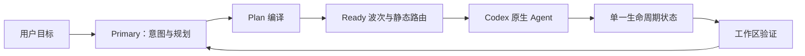

# Codex Cost Orchestrator

[English](README.md)

Codex Cost Orchestrator（CCO）是面向 Codex 原生 Agent 的轻量本地控制面。
Primary 保留目标理解、规划、集成和最终验收；已经闭合的工作则由 CCO 按明确范围、
最新工作区基线和静态路由交给成本更低的原生 Agent。

CCO 只使用 Codex 自身的 Agent runtime，不运行第二套协调器，不依赖在线路由服务，
不保存计费历史，也不要求 MCP 服务器。

## 能做什么

- 一次编译完整逻辑 DAG，再自动生成依赖已满足的执行波次。
- 使用与原生职责一致的 `explorer`、`worker`、`reviewer`。
- 确定性的机械任务优先 Luna；需要有限判断、保护或审查的任务优先 Terra。
- 不会自动选择 Sol；用户可在当前任务中明确指定任意原生支持的模型与思考强度。
- 在宿主真实 Agent 容量内选择最大无冲突 ready set。
- 所有 Codex 任务共享同一规范工作区时，只允许一个可写子 Agent；只有范围不重叠的只读任务可并行。
- ready 数量超过容量时，可安全聚合相容的机械微任务。
- 每个波次都绑定新的 Git 或有界非 Git 工作区状态。
- 依靠原生终止事件唤醒 Primary，不轮询进度。
- 已准备的原生调用和暂停的 worker 都保留写 lease；reviewer 未接受时不会放行下游；只有确认原先处于活动状态的中断、重启和迟到结果才会被 fencing。
- Primary 观察到 typed 429、网络、超时或临时服务错误时，同一个原生 Agent 最多精确重试三次；不会扫描普通 assistant 文本来猜测错误。



## 默认路由

| 工作类型 | 自动顺序 |
| --- | --- |
| 机械型 explorer 或 worker | Luna，然后 Terra |
| 有限判断型 explorer 或 worker | Terra，然后 Luna |
| guarded 工作 | Terra |
| reviewer | Terra |

同一模型优先使用 `max`，其次是 `xhigh`、`high`。路由在创建波次时根据当前宿主
能力解析。若原生 spawn 在创建线程前明确拒绝某个候选，只会使用已准备的下一个候选，
不会静默继承 Primary 的模型。

## 安装

要求：

- Python 3.11+（Python 3.14 之前还需要 `zstandard`）
- 支持插件、Hooks 和原生 Agent 的当前 Codex
- Windows 或 Linux

克隆仓库并添加 marketplace：

```text
git clone https://github.com/KirschBluteX/codex-cost-orchestrator.git
cd codex-cost-orchestrator
python -m pip install -r requirements.txt
codex plugin marketplace add .
codex plugin add codex-cost-orchestrator@codex-cost-orchestrator
```

安装两个不固定模型的原生 Agent profile：

```text
python -B plugins/codex-cost-orchestrator/scripts/install_agents.py --workspace <你的项目> --bootstrap
```

打开 `/hooks`，检查并信任 5 个 CCO Hook，然后新建一个 Codex 任务。最后运行：

```text
python -B plugins/codex-cost-orchestrator/scripts/install_agents.py --workspace <你的项目> --doctor
```

只有在明确替换现有 CCO profile 时才添加 `--replace`。安装器不会覆盖其他 profile
路径，也不会删除被用户修改过的文件。

## 使用

安装后 CCO 默认隐式启用，正常描述任务即可：

```text
重构解析器，保持现有行为，并验证最终状态。
```

也可以显式调用：

```text
使用 $codex-cost-orchestrator:orchestrate 实现并验证这个改动。
```

需要固定路由时直接说明：

```text
本次任务的 worker 和 reviewer 使用 Terra/max。
```

Primary 只需一次性闭合目标、范围、依赖和验收 ID。之后的 ready 计算、路由、
baseline、dispatch identity、continuation 和逻辑结果映射由 CCO 本地完成。子 Agent
名称会显示职责、逻辑节点、模型、思考强度与 generation，便于实时查看。

一个 Codex 任务在显式清理非活动状态前只拥有一份 plan。`status` 除紧凑计数外，
还会直接列出暂停、fenced 或等待 owner 绑定的 dispatch。spawn 即时返回缺少 owner
不会再被当成 worker 失败；SubagentStop 会用受信 rollout 证据完成迟绑定。

Codex 当前没有工具失败 Hook。如果原生 spawn、continuation 或运行中的 Agent 返回 typed failure，
CCO 会通过 `native-failure` 精确结算对应 dispatch。尚未进入 PreToolUse 的 reservation 会有界过期；
一旦原生调用已被 claim，lease 会 fail-closed 保留到 typed settlement、终止结果或宿主重启恢复。
CCO 不会根据子 Agent 的普通文本猜测并重试。

安装、doctor、配置、暂停任务、重启恢复、重试、放弃或清理时使用
`$codex-cost-orchestrator:manage-cco`；普通任务不会加载这些冷路径说明。

## 配置

全局策略位于 `~/.codex/cco.toml`。项目内 `.codex/cco.toml` 只有在其规范根目录已
写入全局 `trusted_project_roots` 时才会生效。

```toml
trusted_project_roots = ["C:/work/my-project"]

[routes.worker.mechanical]
candidates = [
  { model = "gpt-5.6-luna", effort = "max" },
  { model = "gpt-5.6-terra", effort = "max" },
]
```

自动策略不能包含 Sol；当前用户明确指定的模型优先级更高，可以选择 Sol 或其他原生
支持模型。

## 安全边界

CCO 是工作流护栏，不是操作系统安全边界。Primary 仍是可信控制面，并负责集成和最终
验收。只读 leaf 请求 read-only sandbox；worker 只获得一个有界写 lease，且不得 stage。

Git 工作区会保护仓库控制状态、typed scopes、范围内 ignored 内容、路径别名、submodule
和隐藏 status 情况。非 Git 工作区不会执行 `git init`，默认上限为 20,000 个条目和 1 GiB。

CCO 不计算单次任务的真实账单，也不承诺固定节省比例。benchmark 工具可在受控对照中
记录模型的 token 字段，参见 [docs/BENCHMARK.md](docs/BENCHMARK.md)。

运维和恢复命令见 [docs/OPERATIONS.md](docs/OPERATIONS.md)，安全问题报告方式见
[SECURITY.md](SECURITY.md)。

## 开发验证

```text
python -m unittest discover -s tests
python -m ruff check .
python .github/scripts/validate_plugin.py plugins/codex-cost-orchestrator
```

本项目使用 [MIT License](LICENSE)。
