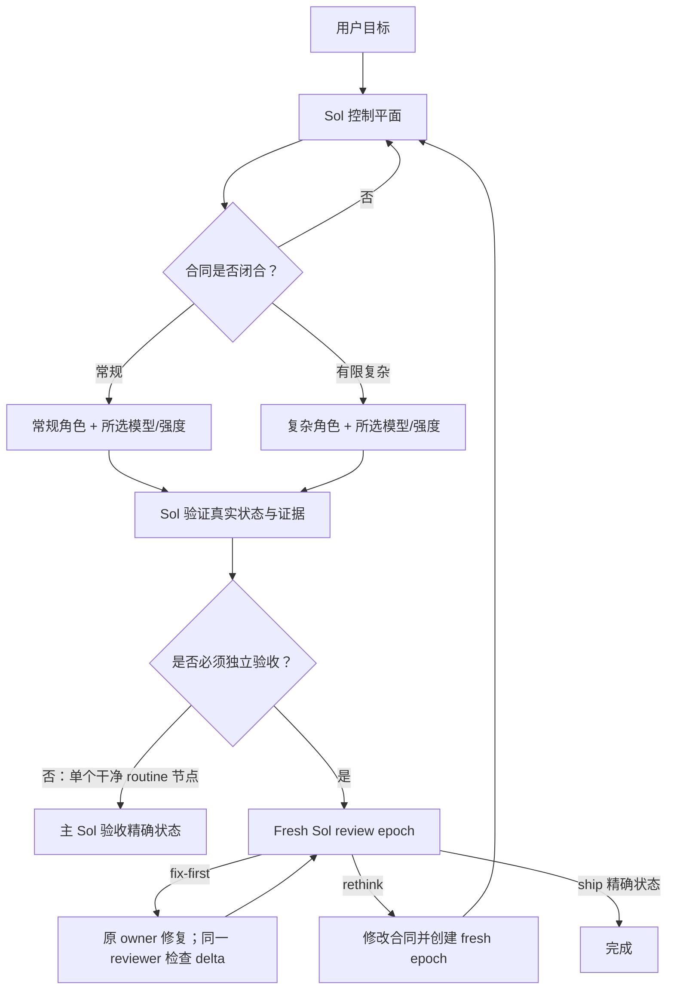

# Codex Cost Orchestrator

[English](README.md) | [简体中文](README.zh-CN.md)

面向 Codex 原生代理、以合同驱动的成本感知编排插件。

Codex Cost Orchestrator（CCO v4）把用户目标、架构、任务拆分和最终验收保留在主
Sol 会话中；将已经闭合的合同交给模型中立的叶子角色，用户可为每个 worker 节点分别
选择模型与思考强度；由主 Sol 检查真实仓库状态与一手证据；最后通过精确状态的 Sol
主验收或独立审查 epoch 决定能否交付。

验收模式在首次 worker spawn 前按结构选定。单个、闭合、低风险 routine 节点可由主 Sol
直接验收；多节点、complex、高风险或异常流程才强制独立审查。只读请求和受约束的原子
修改同样会避开没有收益的委派开销。

它的目标不是让每一次调用都尽可能便宜，而是在不降低验收证据质量的前提下，把
规格清晰、实现量较大的工作交给“足够胜任且成本最低”的执行角色，把昂贵模型集中
用于规划、消除歧义、架构决策和最终验收。

## 默认路由策略

### 默认隐式启用

Skill 显式声明了 `allow_implicit_invocation: true`。用户可以直接用自然语言描述代码
任务，不需要每次输入 `$codex-cost-orchestrator:orchestrate`。Skill 的触发描述覆盖
中大型功能、Bug 修复、重构、跨模块修改、高风险改动，以及需要独立验收的工作。

允许隐式启用不等于无条件创建子代理。路由器会先依据不确定性、耦合程度、影响面和
验证需求分类：

- 只读分析、解释、规划、状态查询，以及没有要求修复的诊断，留在 Sol 中直接完成，
  不创建工作图；
- 能够确信为原子、低风险的小型实现，可进入直接执行快速路径；
- 其他实现任务默认使用完整 CCO 工作图、执行通道、主会话验证，以及分派前已哈希的
  验收模式。

本仓库根目录的 [AGENTS.md](AGENTS.md) 会在开发 CCO 自身时强制采用这套路由策略。
在其他仓库中，安装后的 Skill 可以依靠描述匹配被隐式选择；如果希望得到确定性的
项目级默认行为，可将本仓库的 `AGENTS.md` 规则复制或按需改写到目标仓库。更高优先级
的指令和用户明确给出的执行方式始终优先。

### 直接执行快速路径

只有同时满足下列条件，主 Sol 才能直接实现：结果无歧义且实现方式基本由合同决定；
修改原子、规模小、局限在一个边界明确的区域；一次确定性验证足以提供相称的验收证据；
所有枚举的 `RISK_FLAGS` 均为空：`authentication_authorization`、`build_release`、
`concurrency`、`dependency_boundary`、`destructive_data`、`external_side_effect`、
`migration`、`nondeterministic_verification`、`public_interface`、`schema`、`security`
均不得出现；工作区所有权清晰；委派或独立审查不会带来实质收益。

直接路径不能涉及公共接口、Schema、迁移、依赖边界、身份认证、权限控制、安全机制、
并发行为、构建/发布行为或破坏性数据路径。文件数量只是信号，不是定义：单文件的认证
修改可能必须完整编排；机械性的修改偶尔会同时触及几个紧密耦合文件，仍可能适合直接
执行。

直接路径仍需检查真实 diff 并运行相称的验证，只省去对该任务没有价值的 worker 和
review epoch 开销。第一次写入前，Sol 会记录精确 `DIRECT_BASELINE` 和原有修改路径，
保证任务意外升级后仍能区分本次修改与用户已有工作。

### 执行中升级

如果直接任务扩展到另一个边界区域、出现实质接口或所有权决策、首次验证因非简单原因
失败、诊断演变为系统性排查、回归面扩大，或独立审查开始有价值，必须先升级为完整
编排再继续。

原始 `DIRECT_BASELINE` 继续作为最终验收基线。Sol 先冻结并检查已有 delta，把它登记
为显式 `sol` 合同节点；后续 worker 只把当前状态作为各自租约
基线。最终审查必须从原始基线覆盖到完成状态，同时包含已有 Sol delta 和全部 worker
delta，不能让早期修改隐藏在重建基线之后。出现 Sol-owned 节点时强制独立验收。

### 用户覆盖

点名或调用 `$codex-cost-orchestrator:orchestrate` 只代表选择这个路由器，本身不强制
委派。明确要求“完整 CCO 流程”、worker 通道或 review epoch，才会强制完整编排。明确
要求不委派、单代理或直接执行，会覆盖单纯的 Skill 选择并把工作保留在 Sol。如果同一条
有效指令既要求完整 CCO 又禁止委派，Codex 会在写入前停止并请求消除冲突。任何覆盖都
不能省略必要验证，也不能声称并未发生的测试、审查或隔离。

CCO 始终要求工作图实际使用的 worker 角色；只有验收链最终为独立验收时才要求
reviewer。角色缺失或内容不匹配时，
必须在委派写入前 fail-closed：报告具体角色与恢复命令，不修改 `CODEX_HOME`，也不静默
替换成通用代理。

### 按路径完成

- 只读路径直接回答，不声称发生了实现或审查。
- 直接路径把最终状态与 `DIRECT_BASELINE` 比较，检查所有任务自有路径并运行聚焦验证，
  同时明确报告没有运行 review epoch。
- 完整编排路径必须覆盖 Sol-owned 与 worker-owned 的全部修改，并在精确最终状态通过验收
  关键检查。符合条件的单 routine 图可由主 Sol 验收；独立模式还必须取得绑定该状态的
  `ship` verdict。

## 角色与 worker 选择

| 职责 | 原生角色 | 运行时选择 | 边界 |
| --- | --- | --- | --- |
| 控制平面 | 主 Codex 任务 | Sol；推理强度由用户选择 | 消除歧义、设计、拆分、路由、验证和验收 |
| 常规通道 | `cost_orchestrator_routine_worker` | 每节点由用户选择；自适应默认在 IQ > 90 的候选中偏重成本 | 合同完全决定结果、机械性强、可独立验证的工作 |
| 复杂通道 | `cost_orchestrator_complex_worker` | 每节点由用户选择；自适应默认在 IQ > 90 的候选中偏重质量 | 架构和接口已固定，但算法、调试、兼容性、安全或较广实现仍需有限判断 |
| 审查通道 | `cost_orchestrator_reviewer` | GPT-5.6 Sol / High；请求只读 | 结构门禁要求时的 fresh epoch 与合同不变时的 delta 审查 |

常规与复杂通道描述的是合同闭合度，而不是固定模型。两个 worker TOML 都不写
`model` 或 `model_reasoning_effort`，由原生 spawn 传入选择值；它们仍关闭自身的代理
协作能力，只作为叶子执行器。Codex 原生子代理工具仍是唯一的 Agent runtime。

可在任务请求中按通道或节点分别指定，例如：

```text
这个修改使用 CCO：常规节点使用 <模型A> / high，复杂节点使用 <模型B> / max，reviewer 保持默认配置。
```

两个维度都可以写 `native`，让 Codex 继承或解析完整组合。用户未选择时，CCO 会在新工作图
创建时解析自适应路由：先取 Codex bundled 模型/强度能力与当前
[CodexRadar](https://codexradar.com/) 数据的交集，
严格要求观测 IQ > 90、样本量与任务 cohort 覆盖达标，再通过 Wilson-aware 严格 Pareto
前沿和固定锚点的质量/成本/时间效用选择。常规通道更偏重成本，复杂通道更偏重质量；原生
spawn 校验与真实运行时值仍是最终依据。

用户可以固定一个维度，让算法只选择另一个维度。`route_default` 不与省略传参的 `native`
混用，否则派发前无法闭合模型/强度组合。原生 spawn 在创建线程前拒绝候选时，只能沿该
决策中已哈希绑定的 fallback 顺序前进；用户显式值始终不自动回退。

### 自适应刷新与隐私

每个新工作图检查默认一小时 TTL；最小可配置 TTL 为十分钟。运行中的工作图固定原始路由
决策，不会中途换模型。Radar 原始响应只在内存中校验且不落盘；磁盘仅保留一份 normalized
LKG（源数据最多 72 小时）与一份精简迟滞状态，不保存历史。原子写入产生的临时文件会在
成功与失败路径立即清除；下次运行只清理已过期的遗留临时文件，避免并发任务删除仍在使用
的 staging 文件。

算法先去除严格劣势候选，再依据保守质量、对数成本负担、线性时间负担与测量不确定性进行
固定锚点比较。成本和时间超过锚点后仍持续增加惩罚，因此极端花费或耗时不会被当成“免费”。
当少量额外花费/时间能换来明显质量提升时会选择升级；质量只提高一点但代价大幅增加时不会。
新赢家必须在两个不同的测量快照中连续成立，除非旧候选已不合格或用户更改策略；仅 fingerprint
变化不计为新测量。

默认质量/成本/时间权重为：常规通道 `0.35/0.55/0.10`，复杂通道
`0.70/0.20/0.10`，另有独立的 `0.05` 不确定性惩罚；策略锚点为 `$25` 与 `60 分钟`。
固定锚点用于保持量纲稳定，避免候选集合变化时重新归一化导致选择漂移。这些权重是可覆盖的
运行偏好，而不是“普适最优”声明；IQ 下限不可降到 90 以下。

CodexRadar 是第三方参考数据，不是 OpenAI 对模型能力的保证。其中的 “IQ” 是该网站“最新
有效任务通过率 × 150”的指标，并非通用智力测量。CCO 会校验这一公式，并且只在工作通道与
合同已由结构规则确定后用于选择 worker；它不会决定 Multi 门禁、验收模式、验证或最终审查。

正常任务只使用最终模型与强度，不向用户展示内部评分。CLI 默认只返回精简调度结果，只有
显式使用 `--explain` 才输出解释：

```text
python plugins/codex-cost-orchestrator/scripts/routing_catalog.py resolve --lane routine
python plugins/codex-cost-orchestrator/scripts/routing_catalog.py resolve --lane complex --explain
```



## 协议带来的变化

### 版本化工作节点

每个委派节点都使用 `cco.v4` 数据包，包含稳定的 `NODE`、`CONTRACT_REV`、规范化
`CONTRACT_SHA256`、链式 `INPUT_CLOSURE_SHA256`、线程唯一的 `RUN`、有限
`ATTEMPT` / `FOLLOWUP`、绑定的 `fork_turns`、基线 `LEASE`、`LEASE_GENERATION`、
`STOP_GENERATION`、已哈希的 `exact` / `prefix` 写 scope、稳定验收 ID 和预期验证证据。初始工作数据包加上最新有效的运行中
链式 steer，共同优先于继承对话中的旧假设。

控制平面还会为每个 `NODE@CONTRACT_REV` 维护 single-flight 台账。同一版本处于执行中
只允许一个 active owner。只有 worker 仍明确处于 running 时，不改变合同的 steer 才能沿
canonical task path 继续；worker 完成后必须使用新的 run、attempt、显式路由与 lease generation。

首次 worker spawn 前，Sol 必须构建不可变 graph manifest 与 append-only acceptance chain：逐项重算合同、manifest 与 decision hash，要求每个 acceptance owner 等于声明该 ID 的节点，拒绝全局重复的
acceptance/verification ID，拒绝 exact/prefix 重叠和可移植大小写别名冲突，并把全图不同
scope 并集限制为 128。大型生成目录应使用一个已哈希 prefix scope，而不是枚举数百文件。

`primary` 只适用于一个验证确定、risk flags 中无公共接口/安全/并发/构建发布/迁移/破坏性数据、无
Sol-owned、无并发 Multi、且用户没有要求独立审查的 routine 合同。complex 或多节点图从
一开始就选择 `independent`；任何重试、live follow-up、偏差、scope 意外、路由不符、验证失败、partial 结果、blocked 结果或
实质实现判断都会追加 hash-linked 的 primary→independent 决策。若升级后需要 reviewer 而它不在缓存的 checked set 中，Sol 必须先完成
reviewer profile check，才能发起任何修复或审查；首次 spawn 后不允许抹除历史或降级。这是流程
结构门禁，不依赖不可可靠量化的成本或质量评分。

### 每节点模型与思考强度

用户可为每个 worker 节点分别选择模型与思考强度。`MODEL_POLICY` 与
`EFFORT_POLICY` 分别支持 `user`、`route_default`、`native`。用户选择始终优先；路由默认
来自哈希绑定的自适应选择器，不写死在 worker TOML 中；完整 `native` 组合不传给 spawn，
由 Codex 当前默认值或继承规则解析。自适应路由的 `ROUTING_DECISION_JSON` 通过现有
`INPUTS` 闭包绑定，并与实际 spawn override 核对。未创建线程的拒绝提案不消耗 worker
attempt 或 lease generation；用户选择不可用时不回退，route default 只能尝试已绑定的
下一个候选。可用 worker 启动后，无法观察或不一致的路由会被 fence 并拒绝。

### 结构型 Multi 门禁

完整编排不代表无条件并发。只有同时存在至少两个 dependency-ready 节点、合同与输入闭包
均已闭合、写租约两两不重叠、验收所有权完整、acceptance chain 最终为 `independent`，且可观察到至少
两个可用原生 worker 线程容量，才允许 Multi
并发派发。否则只串行仍不重叠的节点；重叠或人为拆分的节点必须合并到同一 owner；也可把
未解决工作留在 Sol。价格、token、时延、
请求数、文件数和预测质量只能提供建议，不能成为硬门禁。

### 哈希闭包、代际 fencing 与有限恢复

`CONTRACT_SHA256` 绑定稳定任务语义。每次初始派发和 follow-up 都有
`INPUT_CLOSURE_SHA256`，follow-up 还会绑定 `PREVIOUS_INPUT_CLOSURE_SHA256`。
`LEASE_GENERATION` 标识当前写 owner；主控在 interrupt 前递增 `STOP_GENERATION`，
拒绝迟到结果。fence 不能阻止迟到写入，因此 Sol 仍需检查真实 workspace delta。

spawn guardrail 会从可读数据包重建规范 contract 与初始 input preimage（包括
`fork_turns` 和完整验收 ID 集合），并重算所有适用的协议 hash：contract、graph manifest、
acceptance decision、acceptance chain、input closure 和 evidence。worker live steer 携带规范
`BINDING_JSON` 并绑定完整的原生 canonical `TARGET`；reviewer delta 也会在原生
continuation 调用前进行同样的重建与校验。

同一 `NODE@CONTRACT_REV` 的 attempt 会跨输入、角色、模型和强度变化累计；同一 run 的
同一 `NODE@CONTRACT_REV` 最多 3 个 worker run；每个 run 最多 2 次 live follow-up。
每个 review epoch 最多 2 个 fresh reviewer thread，每个 thread 最多 2 次 delta turn。验证失败或 blocked 时，Sol 根据结构化失败 ID、类别、exit status
与有限诊断标识重算稳定 `FAILURE_SIGNATURE`；
相同签名再次出现时，必须采用实质不同的干预方式，不能重复原提示。

每个 checksum 都必须依据
[`contracts-v4.md`](plugins/codex-cost-orchestrator/skills/orchestrate/references/contracts-v4.md)
定义的精确 JSON preimage 生成：

```text
python plugins/codex-cost-orchestrator/scripts/protocol_hash.py hash --domain contract
python plugins/codex-cost-orchestrator/scripts/protocol_hash.py hash --domain graph_manifest
python plugins/codex-cost-orchestrator/scripts/protocol_hash.py hash --domain acceptance_decision
python plugins/codex-cost-orchestrator/scripts/protocol_hash.py hash --domain acceptance_chain
python plugins/codex-cost-orchestrator/scripts/protocol_hash.py hash --domain input_closure
python plugins/codex-cost-orchestrator/scripts/protocol_hash.py hash --domain failure
python plugins/codex-cost-orchestrator/scripts/protocol_hash.py hash --domain evidence
```

这些 SHA-256 值是完整性检查，不是加密。CCO 不会加密提示词、源码或原生 Agent transport。
紧凑协议 JSON 的哈希成本相对一次模型调用可以忽略；大型仓库中可能产生明显开销的是另一项
完整 workspace-state 哈希。

helper 会在哈希前校验完整 cco.v4 schema：精确字段与嵌套类型、显式 scope kind、全图 scope
上限与碰撞、验收模式与 owner 闭合、policy/null 配对、标识覆盖、NFC 文本和规范集合顺序。
哈希不是认证、内容存储，也不能证明遗漏输入已经闭合。`INPUTS`
条目只是内容指纹，不负责传输内容或定位内容；每个条目都必须对应数据包中已经包含的有界
材料，或数据包中明确写出且 worker 可直接读取的精确仓库位置。

### 有界上下文与缓存感知派发

当 `CCO_WORK` 数据包和仓库锚点已包含足够信息时，自定义角色使用
`fork_turns: none`。只有继承对话确实不可缺少时，编排器才选择最小的正整数 turn 数，
覆盖最早仍有效的决定。带自定义角色时绝不使用 `fork_turns: all`。CCO 只使用 `none` 或
有界正整数；其他 full-history 与 override 组合会随 Codex surface 变化，不属于本协议的
兼容性承诺。

稳定策略保存在角色 TOML 中，变化的任务事实放在紧凑数据包中。这样可以避免重复传输
工具 Schema、环境说明、完整历史或全部 diff。部分上下文 fork 会重新构建子代理上下文，
因此这是一条正确性与 token 治理规则，并不承诺一定命中服务端缓存。

### 行为写租约与基线验证

Sol 控制平面为每个活动节点签发一个不重叠的行为写 `LEASE`；全图重叠 scope 会在分派前
被拒绝，不会交给不同 owner。
接受结果前，Sol 会将当前状态与记录基线比较，确认修改路径位于租约内，检查真实 diff，
保留用户原有工作，并重新运行验收关键验证。

租约不是操作系统级文件锁，而是由检测支撑的控制平面所有权规则。发现意外修改时，节点
必须停止并重新建立基线；编排器不会猜测式合并并发修改。

随插件提供的只读辅助脚本可以把 Git 可见状态保存为 JSON，并依据精确允许路径验证后续
差异：

```text
python plugins/codex-cost-orchestrator/scripts/workspace_state.py capture --repo <repository> --output <external-baseline.json>
python plugins/codex-cost-orchestrator/scripts/workspace_state.py verify --repo <repository> --baseline <external-utf8-baseline.json> [--allow exact:<path> ...] [--allow prefix:<directory> ...] [--next-baseline <next.json>]
```

capture 输出 `cco.workspace-state.v2`；verify 输出带 `allowed_scopes` 的
`cco.workspace-verification.v2`。capture 把 UTF-8 JSON 原子写到仓库外，拒绝本地仓库/Git 控制
目录身份以及 Win32 UNC/device 拼写；独立于 status shortcut 哈希全部 tracked worktree
文件；递归绑定已初始化 submodule、marker 与受保护的嵌套控制状态；同时绑定 symbolic/commit HEAD、index、refs、有效 Git
config、hooks、`info`、选定的 Git administrative state，以及 worktree/Git 控制目录的物理
身份。administrative 覆盖 lock files、shallow、`objects/info`（含 alternates）、linked-worktree registry、
reflog 和 merge/rebase/cherry-pick/revert/bisect/sequencer 伪状态。它不会 stage、clean、reset
或改写文件。prefix scope 会拒绝 reparse 后代与包含 submodule 的祖先 prefix；串行节点可在
通过后用 `--next-baseline` 复用已计算快照。不传 `--allow` 时会拒绝所有已观察到的状态变化。

协议 scope 在规范 JSON 中携带 `{kind, path}`，在可读 packet 与 workspace helper 中写为
`exact:<path>` 或 `prefix:<directory>`。kind 属于 `CONTRACT_SHA256`，拒绝无类型值或哈希后
再派生 prefix 权限。协议路径必须使用 Git 中的精确 NFC 拼写、正斜杠和仓库相对段；拒绝绝对路径、盘符、UNC、
反斜杠、`.` / `..`、空段、Git 控制名称、Win32 保留名称和尾随点/空格等别名。已有路径
前缀若经过 reparse traversal 或按文件系统身份解析到 Git 控制目录，也会被拒绝；已有的
大小写与 8.3 别名会在分派前 fail-closed。每个 indexed submodule 是一个原子租约：只允许
其 exact 根路径，拒绝内部子路径和根目录 prefix scope。

该 helper 仍是检测型控制；大型仓库中哈希全部 tracked 文件、递归 submodule 和已记录的
administrative path 可能有明显开销。Git ignored 文件、NTFS 备用数据流、hardlink 内容别名、校验后新建的路径别名、hook
fail-open 与 capture/verify 竞态仍是剩余边界。需要硬隔离时必须依赖实际观察到的 read-only
sandbox。

### 运行中修正与完成后恢复

worker 明确仍在 running 时，Sol 才能通过原生 `send_message` 发送紧凑、合同不变的
`CCO_WORK_FOLLOWUP cco.v4`。每次 live steer 都递增有限计数器、保留哈希绑定的验收 ID、
绑定完整的原生 canonical `TARGET` 并链接新输入闭包；它只是初始数据包上的 delta，携带
精确规范的 `BINDING_JSON`，不能单独作为权限包。

当前 V2 可以透明重载已知的 completed task，但不会重放该 worker 首次 spawn 时的模型/强度
override。由于 worker profile 是 model-neutral，completed 或 idle worker 绝不使用
`followup_task`。Sol 会检查其 delta、fence 并退役旧 owner，然后用完整数据包、显式路由、
新 attempt 与新 lease generation 创建新的 `RUN`。角色、模型、强度、非 follow-up 输入或
实质合同字段改变时同样如此。

这样可以减少重复规划，并防止并行 worker 静默扩张或重叠任务范围。

live steer 是同一活动会话内的优化，不是持久线程存储或缓存命中承诺。角色固定为 Sol High
的 reviewer 可进行有界 `followup_task` delta review，但之后必须再次检查其路由、sandbox
证据与工作区状态；无法一致恢复时改用有界 fresh attempt。原生 `Interrupted` 不是终态，
因此不会再向已 fenced 的路径发消息，只有观察到 idle/terminal 后才可转移租约。

插件提供 fail-open、只读 guardrail。`PreToolUse` hooks 覆盖原生 `Agent`、`send_message` 与
`followup_task`，会拒绝不一致的 CCO 角色、数据包、完整 continuation target、验收闭包、
fork、模型/强度请求、未知字段或超过 1 MiB 的信封，重建自包含 preimage，并阻断 worker
`followup_task`。它没有持久台账，
不能证明 prior hash 确实签发、目标仍在运行、租约互斥或完整 hook 覆盖。`SubagentStop` hook 检查结果 envelope、重算声明
的失败 checksum，并最多请求一次纯格式修复。该修复不是实现 follow-up，不能授权继续工作。
两者都不判断报告真假，也不能替代主 Sol。

插件 hook 会被发现，但默认处于未信任状态，因此仅安装插件不会执行它。请打开
`/hooks`，检查来自插件的命令和当前 hash，再显式信任。hash 改变后需要重新决定是否
信任。命令 hook 使用宿主操作系统的环境权限，而不是 reviewer sandbox；本项目的 hooks
均为只读，并测试了不修改工作区的行为，但信任前仍应检查源代码。

### 主验收与审查 epoch

Sol 在首次 worker spawn 前构建并验证 graph manifest 与 acceptance chain。在同一 `CURRENT_STATE` 上，每个合同
要求的 verification 必须恰有一条一手证据，其 operation、验收 ID 和实现 owner 与 graph
完全一致。Sol 将规范 chain 与 `ACCEPTANCE_CHAIN_SHA256` 嵌入 `EVIDENCE_JSON`，再把
完整证据计算为 `EVIDENCE_SHA256`。遗漏、额外、重复、伪造、失败或 unavailable 的验证证据
都不能进入任一验收模式。chain 持续符合 `primary` 条件时，主 Sol 会再次确认结构条件并
直接验收未变化的证据状态，不再创建第二个 Sol。最终为 `independent` 时，reviewer 必须逐项重算合同、manifest、decision、chain 和 evidence hash，并核对
合同引用、验收 ID 与当前状态。每个 epoch 的首次审查使用全新 Sol reviewer，且不继承实现者
结论；review 输入闭包绑定全部合同 hash、`GRAPH_MANIFEST_SHA256`、`ACCEPTANCE_CHAIN_SHA256`、验收 ID、当前状态、
证据 hash、累计 delta 与风险。

如果 reviewer 返回 `fix-first` 且合同不变，原 worker 完成有限修复，Sol 为新状态刷新
证据，并把刷新后的规范 `EVIDENCE_JSON` 交给同一 reviewer 重算后再做有界 delta review。
目标、架构、公共接口/Schema、安全、所有权、
排除项或验收标准改变时必须创建 fresh epoch；`rethink` 同样如此。只有 reviewer 回显完整
ID、review 闭包、`EVIDENCE_SHA256` 与精确 `REVIEWED_STATE` 时，`ship` 才有效；之后任何
修改都会让证据闭包和 verdict 同时失效。

## 安装

要求：

- 当前版本的 Codex CLI 或桌面端，且支持插件、原生子代理和自定义 agent；
- 能使用用户或路由所选择的 worker 模型/强度组合；独立验收时还需 reviewer 模型；
- Git 与 Python 3.11 或更高版本。

克隆公开仓库，将该 checkout 注册为 marketplace，安装插件，再安装配套角色配置：

```text
git clone https://github.com/KirschBluteX/codex-cost-orchestrator.git
cd codex-cost-orchestrator
codex plugin marketplace add .
codex plugin add codex-cost-orchestrator@codex-cost-orchestrator
python plugins/codex-cost-orchestrator/scripts/install_agents.py
python plugins/codex-cost-orchestrator/scripts/install_agents.py --check
```

这些命令同时适用于 PowerShell 和 POSIX shell。在 Windows 上，如果系统配置的是 Python
Launcher，可用 `py -3` 代替 `python`。

安装器只添加缺失文件，不会覆盖内容不同的用户配置、修改 `config.toml` 或调用 Codex。
默认目标是已设置时的 `$CODEX_HOME/agents`，否则是 `~/.codex/agents`；默认检查当前
workspace。若目标 config home 或活动项目 `.codex` 层中存在名称相同但内容不同的 selected
role，安装或 `--check` 会 fail-closed。评估安装器时可指定一次性路径：

```text
python plugins/codex-cost-orchestrator/scripts/install_agents.py --target-dir <agents-directory> --workspace <active-workspace>
python plugins/codex-cost-orchestrator/scripts/install_agents.py --target-dir <agents-directory> --workspace <active-workspace> --upgrade
python plugins/codex-cost-orchestrator/scripts/install_agents.py --target-dir <agents-directory> --workspace <active-workspace> --check
```

`--upgrade` 只替换与已知已发布 CCO 模板逐字节一致的旧 profile；任何 selected 文件未知或
被用户修改时，都会在写入前整体拒绝。所有新文件和备份会先准备完成；后续替换或精确性
检查失败时，整个 selected 批次都会回滚。同目录 hardlink 备份会恢复已测试的原 inode、字节、mode
与 mtime；若目标 identity 或内容改变则拒绝覆盖，但不承诺 POSIX ctime 或消除最终 check/replace 竞态；文件系统不支持同目录 hardlink 时会在
变更前停止。

可以重复传入 `--profile routine`、`--profile complex` 或 `--profile reviewer`，只安装或
检查某个工作图实际需要的角色；不传 `--profile` 时默认选择三个角色。

安装后请新建 Codex 任务。自定义 agent type 在任务开始时被发现，已经打开的任务可能
看不到刚安装的配置。

完整 CCO 写入前，新任务必须暴露原生 spawn 的 `task_name`、`message`、`agent_type` 和
`fork_turns`；某一维不是 `native` 时还必须暴露 `model` 或 `reasoning_effort`。安装配置通过
`--check` 并不能证明这些运行时能力；字段或角色缺失时必须在委派写入前 fail-closed。

每个目标仓库的首个 CCO graph 之前，都应在该仓库中运行非写入检查，或用 `--workspace`
指向它。扫描覆盖可见的文件配置层，但不能证明未暴露的 managed/runtime 配置没有再次覆盖；
因此仍必须观察实际 role/model/effort 并严格检查结果。

普通匹配的实现请求无需显式调用。下面的示例还明确要求 worker 通道和 review epoch，
因此会强制使用完整路径：

```text
使用 $codex-cost-orchestrator:orchestrate 实现并验证这个修改，通过成本感知 worker 通道执行，并在最后运行 review epoch。
```

## 运行时路由证据

原生 V2 spawn 只返回 canonical task path，不公开有效角色、模型和思考强度详情。原生参数
校验只能证明请求组合被接受，不能证明自定义角色没有覆盖它。本地 rollout 可访问时，只读
检查器可以接收该精确 canonical path 或 child UUID。path 查找默认使用当前
`CODEX_THREAD_ID` 作为 parent，也可显式传入 parent UUID：

```text
python plugins/codex-cost-orchestrator/scripts/inspect_agent_runtime.py <child-uuid-or-canonical-path>
python plugins/codex-cost-orchestrator/scripts/inspect_agent_runtime.py --sessions-dir <sessions-directory> --parent-thread-id <parent-uuid> <canonical-path>
python plugins/codex-cost-orchestrator/scripts/inspect_agent_runtime.py --expect-role <role> --expect-model <model> --expect-effort <effort> <child-uuid-or-canonical-path>
```

它只输出 `thread_id`、`agent_role`、`model`、`effort`、`sandbox_policy_type` 和
`permission_profile_type`；会拒绝无效 ID/path/parent、多个匹配，以及缺失或冲突的必需
元数据；不会输出提示词、消息、路径、parent ID、provider 配置、环境变量或任意 rollout 内容。只有使用
`native` 的选择维度才省略对应 expectation；其实际值仍必须存在且在 run 内一致。

## 更新

0.4.0 将每个 worker 与证据闭合到首次分派前构建的不可变 graph manifest 和 append-only primary/independent decision chain，加入自适应 primary/independent
验收、哈希绑定 exact/prefix scope、全图碰撞与 128-scope 门禁、精确 Git 拼写和
administrative state 覆盖、submodule 原子租约及小型 run/follow-up 硬上限，并让已知模板
升级支持保留元数据的批次回滚。
对于干净的现有 checkout：

```text
git pull --ff-only
codex plugin add codex-cost-orchestrator@codex-cost-orchestrator
python plugins/codex-cost-orchestrator/scripts/install_agents.py --upgrade
python plugins/codex-cost-orchestrator/scripts/install_agents.py --check
```

升级只接受精确匹配的已知旧模板；未知或被用户修改的 profile 会被拒绝，运行期 I/O 失败也
会回滚而不保留部分 profile 集或改变原文件元数据。请检查拒绝原因并有意处理差异，重新执行 `--check`，然后
新建 Codex 任务。

## 本地验证

仓库测试与 diff 检查跨平台可用：

```text
python -X utf8 -B -m unittest discover -s tests -v
git diff --check
```

如果已安装 Codex 自带的 creator skills，也应运行对应校验器。

POSIX：

```sh
codex_home=${CODEX_HOME:-"$HOME/.codex"}
python "$codex_home/skills/.system/plugin-creator/scripts/validate_plugin.py" plugins/codex-cost-orchestrator
python "$codex_home/skills/.system/skill-creator/scripts/quick_validate.py" plugins/codex-cost-orchestrator/skills/orchestrate
```

PowerShell：

```powershell
$codexHome = if ($env:CODEX_HOME) { $env:CODEX_HOME } else { Join-Path $HOME ".codex" }
python (Join-Path $codexHome "skills/.system/plugin-creator/scripts/validate_plugin.py") plugins/codex-cost-orchestrator
python (Join-Path $codexHome "skills/.system/skill-creator/scripts/quick_validate.py") plugins/codex-cost-orchestrator/skills/orchestrate
```

旧的 POSIX 入口 `install-agents.sh`、`inspect-agent-runtime.sh` 和 `verify.sh` 仍保留为
Python 实现的薄封装。如果 `PATH` 中没有 `python3`，可用 `PYTHON` 指定其他 Python
可执行文件。

CI 会在 Windows 和 Ubuntu 上运行 unittest、仓库插件合同校验器、固定版本的 OpenAI
skill 校验器和 `git diff --check`。它只使用 runner 的一次性状态，不会把插件安装到
用户 Codex home，也不会调用模型。当前 Codex 官方 plugin validator 由 Codex 而非固定
的 `openai/skills` checkout 分发，因此发布前还会在本机交叉运行该校验器。

## 限制与信任模型

- 写租约、数据包格式和路径检查属于“检测型”策略控制，不是文件系统隔离。
- Codex hook 当前为 fail-open，永远不能替代主会话的 diff 与测试验证。
- reviewer 配置请求 `read-only`，但宿主权限可能扩大该请求。只有观察到的运行时元数据
  确实为 `read-only` 时，才能声称存在操作系统级只读；否则只能称为行为只读，必须执行
  精确前后状态比较，并把更宽权限列为残余风险。
- worker 和 reviewer 的结果数据包只是声明，主 Sol 检查真实状态与证据后才能接受。
- profile 精确检查与 shadow 扫描只覆盖可见文件配置层；未暴露的 managed/runtime role
  来源仍是显式残余风险。
- fresh Sol review 与编排器上下文隔离，但不代表模型家族或 provider 独立。
- 本仓库定义路由和验证策略，不提供硬工作区锁、独立 agent runtime、provider 切换、
  持久成本台账，也不保证固定节省比例。实际成本取决于任务闭合程度、上下文大小、重试率
  和模型定价。
